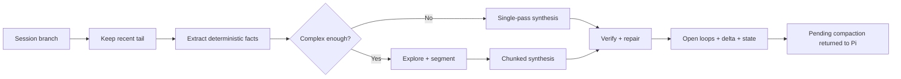

# Architecture

This document describes how `pi-smart-compact` works at a system level.

## Overview

`pi-smart-compact` is a Pi extension for **verification-oriented smart compaction**.

Its job is not to produce a generic recap. Its job is to preserve the agent's working state so the next turn can continue with minimal loss.

The design combines three ideas:

- **agentic compaction** — let the system inspect the session, not just summarize it
- **Kamradt-style chunking** — segment large conversations into more coherent units before synthesis
- **EESV** — **Extract → Explore → Synthesize → Verify**

## Integration surfaces

The extension registers three surfaces from `src/index.ts`:

1. `/smart-compact`
   - interactive or direct manual compaction
2. `session_before_compact`
   - auto-triggered smart compaction before Pi's default compaction
3. `smart_compact` tool
   - agent-callable compaction for long sessions

A short-lived pending compaction is kept in memory and consumed by Pi when compaction is applied.

## High-level flow

## Core execution model

### 1. Entry and context gate

`src/index.ts` resolves models, parses command arguments, and routes work into `runSmartCompact()` in `src/app/run-smart-compact.ts`. The orchestrator is a thin pipeline of typed stages (see `src/app/run-context.ts`); each stage is a separate module under `src/app/steps/`.

Before doing expensive work, the system checks context size. If usage is below the threshold in `src/constants.ts`, compaction is skipped.

## 2. Keep window and preprocessing

`src/app/steps/window.ts` keeps a recent tail of messages untouched so very recent context stays live.

Before summarization, the pipeline also:

- prunes redundant messages
- serializes the compacted portion of the conversation
- creates a backup when enabled
- loads previous compaction context
- checks incremental extraction cache
- loads project fingerprint data if available

## 3. Extract

Primary implementation: `src/utils/extraction.ts`

This phase is deterministic and uses **zero LLM calls**.

It extracts:

- modified files
- read files
- deleted files
- tool and bash-like errors
- retry / resolution signals
- explicit and implicit decisions
- constraints and preferences
- heuristic topic segments
- timeline events
- main goal
- open loops

This phase provides the ground truth used later by synthesis and verification.

## 4. Explore

Primary implementation: `src/phases/explore.ts`

Exploration is optional. It runs only when the session appears complex enough.

If it runs, the model can inspect the conversation through a small toolset such as:

- message ranges
- conversation search
- recent user messages
- local context around a message
- file-change lookups
- error chains

If tool support is unavailable, the system falls back to a direct structured analysis path.

## 5. Synthesize

Primary implementation: `src/phases/synthesize.ts`

Two synthesis modes exist:

### Single-pass
Used when the compacted conversation still fits under the configured single-pass threshold.

### Hierarchical
Used for larger sessions:

1. merge heuristic and exploratory boundaries
2. create chunks
3. batch chunks according to token budget
4. summarize batches
5. assemble a final summary

Important behaviors:

- session-aware prompting
- decision propagation across later batches
- provider-aware output limits and concurrency
- deterministic fallback assembly when LLM assembly fails

## 6. Verify

Primary implementation: `src/phases/verify.ts`

Verification scores the summary against deterministic extraction data.

It checks for things like:

- missing modified files
- missing unresolved errors
- missing high-confidence constraints
- weak goal coverage
- missing structure sections
- suspicious fabricated file references
- done/unresolved inconsistencies
- missing explicit decisions
- missing open-loop coverage

Repair order is intentional:

1. accept if good enough
2. deterministic patch first
3. LLM patch only if still insufficient

## 7. Post-processing and persistence

After verification, `src/app/steps/state.ts` and `src/utils/state.ts` enrich the summary, and `src/app/steps/persist.ts` plus `runDamageDetection` apply the compaction and persist reusable state.

Post-processing includes:

- open-loop extraction and injection
- `CompactionState` construction
- delta computation against previous compaction
- changes-since-last-compaction injection
- project fingerprint persistence
- compaction state persistence
- metrics logging
- best-effort damage detection

## Runtime state and artifacts

The extension writes data under `~/.pi/agent/`, including:

- conversation backups
- extraction cache
- metrics logs
- project fingerprints
- compaction states
- damage reports

Important TTLs in the current design:

- pending in-memory compaction: 5 minutes
- exploration tool-support cache: 30 minutes
- extraction cache: 1 hour
- compaction state: 7 days

## Key files

The code is organized into five layers, each with a single responsibility:

### Entry layer

| File | Responsibility |
| --- | --- |
| `src/index.ts` | extension registration, command parsing, auto-trigger hook |
| `src/constants.ts` | version, thresholds, prompts, config keys |
| `src/types.ts` | shared types and discriminated unions |

### Orchestration layer (`src/app/`)

| File | Responsibility |
| --- | --- |
| `src/app/run-smart-compact.ts` | top-level pipeline orchestrator (was `src/core.ts`) |
| `src/app/run-context.ts` | typed stage chain (`RcBase → Prepared → Windowed → … → Stated`) |
| `src/app/steps/prepare.ts` | resolve config, auth, provider caps |
| `src/app/steps/window.ts` | pick the prefix of messages to compact |
| `src/app/steps/recover.ts` | recover full content for log-truncated messages |
| `src/app/steps/tier.ts` | choose compaction tier (none/light/balanced/aggressive) |
| `src/app/steps/extract.ts` | pruning + deterministic extraction with incremental cache |
| `src/app/steps/synthesize.ts` | single-pass / EESV synthesis |
| `src/app/steps/verify.ts` | structural verification + repair |
| `src/app/steps/state.ts` | enrich summary with state machine + open loops |
| `src/app/steps/persist.ts` | apply compaction, save fingerprint, persist state |
| `src/app/steps/metrics.ts` | record success / failure metrics |

### Domain layer (`src/domain/`)

Pure semantics; no I/O, no async, no globals.

| File | Responsibility |
| --- | --- |
| `src/domain/summary-schema.ts` | canonical section list + heading regex |
| `src/domain/summary-parse.ts` | parse/serialize summary into structured sections |

### Algorithm layer (`src/phases/`)

| File | Responsibility |
| --- | --- |
| `src/phases/explore.ts` | targeted exploration with tool-call probing |
| `src/phases/synthesize.ts` | chunking, single-pass compact, batch summarization, assembly |
| `src/phases/verify.ts` | scoring, gap detection, summary patching |

### Infrastructure layer (`src/infra/`)

All external-world interaction (fs, time, network, services container).

| File | Responsibility |
| --- | --- |
| `src/infra/fs.ts` | atomic writes, advisory locks |
| `src/infra/paths.ts` | canonical cache/session/backup paths |
| `src/infra/git.ts` | cached git-root discovery |
| `src/infra/clock.ts` | injectable wall clock |
| `src/infra/llm-client.ts` | LLM client seam (production wraps with retry) |
| `src/infra/llm-retry.ts` | 429/5xx exponential backoff + jitter + Retry-After |
| `src/infra/services.ts` | per-run services container (metrics, clock, llm, tool-support cache) |

### Utility layer (`src/utils/`)

| File | Responsibility |
| --- | --- |
| `src/utils/extraction.ts` | deterministic fact extraction (files, errors, decisions) |
| `src/utils/pruning.ts` | redundancy removal on the message list |
| `src/utils/state.ts` | structured state, open loops, delta |
| `src/utils/helpers.ts` | config, backups, batching, shared helpers |
| `src/utils/cache.ts` | metrics log + extraction prefix cache |
| `src/utils/fingerprint.ts` | project fingerprinting (language, framework, deps) |
| `src/utils/damage.ts` | post-compaction regression signals |
| `src/utils/id-fingerprint.ts` | compact SHA-256 fingerprint of entry-id arrays |
| `src/utils/session-log.ts` | streaming JSONL parser for the Pi session log |
| `src/utils/tokens.ts` | per-(provider,model) token estimation with EMA calibration |
| `src/utils/type-guards.ts` | runtime validators for cross-version compatibility |
| `src/utils/logger.ts` | stderr-prefixed log shim |
| `src/utils/fingerprint.ts` | project fingerprint cache |

### UI layer (`src/ui/`)

| File | Responsibility |
| --- | --- |
| `src/ui/overlays.ts` | model/profile pickers, progress, result, dashboard screens |
| `src/ui/dashboard-format.ts` | pure formatters for the metrics dashboard |

## Safety properties

The architecture intentionally biases toward safety:

- deterministic extraction before summarization
- adaptive exploration instead of always-on tool use
- verified file lists and error context
- deterministic repair before additional LLM calls
- hallucinated file-reference detection
- stateful tracking of open loops and cross-compaction deltas

## Design constraints

A few constraints shape the implementation:

- tool-driven compaction must not compact the conversation mid-turn
- summaries must preserve exact file paths and identifiers where possible
- recent conversation tail should remain live outside the compacted region
- docs should separate user-facing overview from maintainer-facing internals

## Extending the system

When adding features, prefer this order of operations:

1. extract more deterministic signal if possible
2. enrich exploration only when needed
3. keep synthesis prompts structured and bounded
4. strengthen verification before increasing model dependence
5. update tests and docs in the same change
