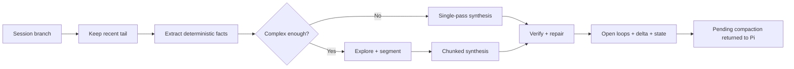

# Architecture

System-level design of `pi-smart-compact`. This is the maintainer-facing
companion to the user-facing [`README.md`](./README.md).

> **Job:** not to produce a generic recap, but to preserve the agent's working
> state so the next turn can continue with minimal loss.

## Design ideas

The design combines three ideas:

- **Agentic compaction** — let the system inspect the session, not just summarize it.
- **Kamradt-style chunking** — segment large conversations into coherent units before synthesis.
- **EESV** — **Extract → Explore → Synthesize → Verify**: facts first, synthesis second, verification last.

## Integration surfaces

Registered in [`src/index.ts`](./src/index.ts). See the README for usage; this
section is about lifecycle.

| Surface | Lifecycle |
| --- | --- |
| `/smart-compact` | Manual command. Interactive picker or direct args. Bypasses the adaptive gate. |
| `session_before_compact` | Auto hook. Consumes any pending summary, else runs when context pressure is high. |
| `smart_compact` tool | Agent-callable. Prepares a pending summary; never compacts mid-turn. |

A short-lived pending compaction is staged in the [`PendingSlot`](#pending-compaction-slot)
and handed to Pi when compaction is applied.

## Pipeline at a glance



The orchestrator ([`src/app/run-smart-compact.ts`](./src/app/run-smart-compact.ts))
threads a typed context through ten stages:

| # | Stage | Module | Transition |
| ---: | --- | --- | --- |
| 1 | prepare | `app/steps/prepare.ts` | config + auth + provider caps |
| 2 | window | `app/steps/window.ts` | pick the prefix to compact |
| 3 | recover | `app/steps/recover.ts` | restore log-truncated messages |
| 4 | tier | `app/steps/tier.ts` | choose none / light / full |
| 5 | extract | `app/steps/extract.ts` | prune + deterministic extraction + cache |
| 6 | synthesize | `app/steps/synthesize.ts` | single-pass or EESV |
| 7 | verify | `app/steps/verify.ts` | structural verify + repair |
| 8 | state | `app/steps/state.ts` | state machine + open loops + delta |
| 9 | persist | `app/steps/persist.ts` | stage pending, apply compaction |
| 10 | metrics | `app/steps/metrics.ts` | success / failure record |

## The typed stage machine

[`src/app/run-context.ts`](./src/app/run-context.ts) models the pipeline context
as a **state machine of branded intersection types**. Each step accepts the
previous stage type and returns the next, so reordering or skipping a step is a
**compile-time error**, not a runtime crash:

```
RcBase
  → PreparedRc      (after prepare)
  → WindowedRc      (after window)
  → RecoveredRc     (after recover)
  → TieredRc        (after tier)
  → ExtractedRc     (after extract)
  → SynthesizedRc   (after synthesize)
  → VerifiedRc      (after verify)
  → StatedRc        (after state)
```

Each stage adds a `_prepared` / `_windowed` / … discriminator field that is
**never read at runtime** — it exists only to carry the type-level proof.
Mutation is preserved: a step mutates its input object and casts it to the
next stage (no per-step copy of ~30 fields). The final alias
`RunContext = StatedRc` keeps post-`buildState` consumers readable.

This is what lets `applyCompaction` read `rc.details` with zero `!` non-null
assertions: the type system proves `buildState` has run.

## Core execution model

### Entry and context gate

`src/index.ts` resolves models, parses command arguments, and routes work into
`runSmartCompact()`. Before any expensive work, the system checks context size
against the threshold in `src/constants.ts`. Auto / tool runs are skipped while
context is small; manual `/smart-compact` bypasses the gate.

### Keep window and preprocessing

`app/steps/window.ts` keeps a recent tail of messages untouched so very recent
context stays live, anchored by:

- **pi-toolkit anchor protection** — never compact past the latest on-branch anchor
- **`toolCall` / `toolResult` boundary guard** — never orphan a result from its call

Before summarization the pipeline also prunes redundant messages, serializes the
compacted portion, creates a backup, loads previous compaction context, checks
the incremental extraction cache, and loads the project fingerprint.

### Extract

Primary: [`src/utils/extraction.ts`](./src/utils/extraction.ts). **Zero LLM calls.**

Deterministically pulls: modified / read / deleted files, tool and bash-like
errors, retry / resolution signals, explicit & implicit decisions, constraints
and preferences, heuristic topic segments, timeline events, the main goal, and
open loops. **This is the ground truth** that synthesis and verification trust.

### Explore

Primary: [`src/phases/explore.ts`](./src/phases/explore.ts). Optional — runs only
when the session looks complex (gated by `shouldExplore`). The model inspects
the conversation through a small toolset: message ranges, conversation search,
recent user messages, local context around an index, file-change lookups, and
error chains. Tool support is runtime-probed once and cached per run; if a
provider has no function calling, the system falls back to a direct structured
analysis path.

### Synthesize

Primary: [`src/phases/synthesize.ts`](./src/phases/synthesize.ts). Two modes:

- **Single-pass** — when the compacted conversation fits under the configured threshold.
- **Hierarchical** — for larger sessions: merge heuristic + exploratory boundaries → chunk → batch by token budget → summarize batches → assemble.

Behaviors: session-aware prompting, decision propagation across later batches,
provider-aware output limits and concurrency (wave scheduling), and a
deterministic fallback assembly when LLM assembly fails.

### Verify

Primary: [`src/phases/verify.ts`](./src/phases/verify.ts). Scores the summary
against the deterministic extraction. It checks for missing modified files,
missing unresolved errors, missing high-confidence constraints, weak goal
coverage, missing structure sections, suspicious fabricated file references,
done/unresolved inconsistencies, missing explicit decisions, and missing
open-loop coverage.

**Repair order is intentional:** (1) accept if good enough → (2) deterministic
patch first (free, idempotent) → (3) LLM patch only if still insufficient.

## State, caching & persistence

Post-verification, `app/steps/state.ts` + `src/utils/state.ts` enrich the
summary, and `app/steps/persist.ts` applies the compaction and persists
reusable state.

| Concern | Where | Notes |
| --- | --- | --- |
| Open-loop injection | `utils/state.ts` | inserted before Next Steps via the canonical parser |
| `CompactionState` | `utils/state.ts` | machine-readable, reused across compactions |
| Cross-compaction delta | `utils/state.ts` | "Changes Since Last Compaction" section |
| Incremental extraction cache | `utils/cache.ts` + `utils/id-fingerprint.ts` | SHA-256 prefix fingerprint + tail; safe only when the pruned prefix still matches |
| Session-log recovery | `utils/session-log.ts` | streaming JSONL parse; bypasses pi-toolkit truncation by entry-id mapping |
| Project fingerprint | `utils/fingerprint.ts` | language / framework / key dirs across sessions |
| Damage detection | `utils/damage.ts` | best-effort post-compaction regression signals |

**Important TTLs:** pending in-memory compaction 5 min · exploration
tool-support cache 30 min · extraction cache 1 h · compaction state 7 d · remediation hints 7 d.

## Concurrency & safety model

The extension is built to run safely alongside other Pi sessions and other
extensions.

### Pending-compaction slot

[`src/app/pending-slot.ts`](./src/app/pending-slot.ts) is an encapsulated,
host-agnostic state cell (one producer, one consumer, single-threaded event
loop). `consume()` returns a discriminated result:

| `ConsumeResult.kind` | Meaning |
| --- | --- |
| `ok` | fresh payload for this session |
| `empty` | nothing staged |
| `expired` | older than the 5-minute TTL |
| `mismatch` | staged by a **different** session (cross-session leak guard) |

Session identity comes from [`infra/session-identity.ts`](./src/infra/session-identity.ts):
a real id when the host exposes one, otherwise a per-call unforgeable
`unresolved:<uuid>` — two unresolved sessions can never collide.

### Cancellation & hard timeout

Some providers ignore `AbortSignal`. The auto-trigger therefore uses a shared
[`ExternalCancellation`](./src/app/run-smart-compact.ts) handle as a second line
of defense: an outer `setTimeout` fires `abort()` and sets `timedOut`, and every
side-effect gate in the orchestrator checks that flag before writing state or
applying compaction. No `Promise.race` is needed — the shared flag drives the
bailout, eliminating the race where the outer timer fired while the pipeline was
mid-`applyCompaction`.

### Filesystem & concurrency

All disk writes go through [`src/infra/fs.ts`](./src/infra/fs.ts): atomic
temp-file + rename so a crash never leaves a half-truncated JSON, and a
`mkdir`-based advisory lock around the append-only metrics log so concurrent
sessions cannot interleave bytes. Per-run state lives on the
[`services` container](#dependency-injection), not module singletons.

## Provider awareness

[`src/utils/tokens.ts`](./src/utils/tokens.ts) keeps a per-provider capability
table (Anthropic, OpenAI, Google, DeepSeek, MiniMax, Xiaomi, Mistral, xAI, …)
with unknowns falling back to a safe default + fuzzy alias matching. Each entry
drives pipeline behavior:

| Capability | Drives |
| --- | --- |
| `maxOutputTokens` | caps synthesis / patch budgets |
| `supportsTools` (`true \| false \| "probe"`) | exploration tool-call probing |
| `concurrencyLimit` | batch synthesis wave scheduling |
| `cacheStrategy` | prompt-cache retention per call |
| `timeoutMultiplier` | auto-trigger hard-timeout headroom |
| `singlePassTokenMultiplier` | single-pass vs chunked threshold |
| `tokenRatioEstimate` | token estimation; refined by per-(provider,model) **EMA calibration** |

## Dependency injection

[`src/infra/services.ts`](./src/infra/services.ts) is a per-`runSmartCompact`
service bag. The previous module-level singletons (metrics array, tool-support
cache, token calibration, compact-session id) leaked state across sessions and
across tests. Each run gets its own container:

| Service | Role |
| --- | --- |
| `clock` | injectable wall clock (deterministic tests) |
| `llm` | LLM client seam (production wraps with retry) |
| `toolSupport` | provider tool-support cache (1 h TTL) |
| `metrics` | bounded metrics sink |
| `extractionCacheStats` | hit / miss counters |
| `tokenCalibration` | per-(provider,model) EMA factors |
| `compactSessionId` | per-run prompt-cache namespace |

## Layer responsibilities

The code is organized into six layers, each with a single responsibility.

### Entry layer

| File | Responsibility |
| --- | --- |
| `src/index.ts` | extension registration, command parsing, auto-trigger hook |
| `src/constants.ts` | version, thresholds, prompts, config keys |
| `src/types.ts` | shared types and discriminated unions |

### Orchestration layer (`src/app/`)

| File | Responsibility |
| --- | --- |
| `app/run-smart-compact.ts` | top-level pipeline orchestrator |
| `app/run-context.ts` | typed stage chain (`RcBase → … → StatedRc`) |
| `app/pending-slot.ts` | encapsulated pending-compaction state cell |
| `app/explore-wrap.ts` | thin re-export shim isolating the explore import for headless tests |
| `app/steps/prepare.ts` | resolve config, auth, provider caps |
| `app/steps/window.ts` | pick the prefix of messages to compact |
| `app/steps/recover.ts` | recover full content for log-truncated messages |
| `app/steps/tier.ts` | choose compaction tier (none / light / full) |
| `app/steps/extract.ts` | pruning + deterministic extraction with incremental cache |
| `app/steps/synthesize.ts` | single-pass / EESV synthesis |
| `app/steps/verify.ts` | structural verification + repair |
| `app/steps/state.ts` | enrich summary with state machine + open loops |
| `app/steps/persist.ts` | apply compaction, save fingerprint, persist state |
| `app/steps/metrics.ts` | record success / failure metrics |

### Domain layer (`src/domain/`)

Pure semantics — no I/O, no async, no globals.

| File | Responsibility |
| --- | --- |
| `domain/summary-schema.ts` | canonical section kinds + heading classification |
| `domain/summary-parse.ts` | parse/render summary into structured sections; placement (`before`/`after`) |

### Algorithm layer (`src/phases/`)

| File | Responsibility |
| --- | --- |
| `phases/explore.ts` | targeted exploration with tool-call probing |
| `phases/synthesize.ts` | chunking, single-pass compact, batch summarization, assembly |
| `phases/verify.ts` | scoring, gap detection, summary patching |

### Infrastructure layer (`src/infra/`)

All external-world interaction.

| File | Responsibility |
| --- | --- |
| `infra/fs.ts` | atomic writes, advisory locks |
| `infra/paths.ts` | canonical cache/session/backup paths |
| `infra/git.ts` | cached git-root discovery |
| `infra/clock.ts` | injectable wall clock |
| `infra/llm-client.ts` | LLM client seam (production wraps with retry) |
| `infra/llm-retry.ts` | 429/5xx exponential backoff + jitter + Retry-After |
| `infra/services.ts` | per-run services container |
| `infra/session-identity.ts` | robust session-id resolution with opaque `unresolved:` fallback |
| `infra/ai-messages.ts` | boundary adapters between `LlmMessage` and pi-ai `Message` |

### Utility layer (`src/utils/`)

| File | Responsibility |
| --- | --- |
| `utils/extraction.ts` | deterministic fact extraction (files, errors, decisions) |
| `utils/pruning.ts` | redundancy removal on the message list |
| `utils/state.ts` | structured state, open loops, delta, pinned-path preservation |
| `utils/helpers.ts` | config, backups, batching, shared helpers, backup list/restore |
| `utils/cache.ts` | metrics log + extraction prefix cache + dashboards |
| `utils/fingerprint.ts` | project fingerprinting (language, framework, deps) |
| `utils/damage.ts` | post-compaction regression signals + remediation hints |
| `utils/id-fingerprint.ts` | compact SHA-256 fingerprint of entry-id arrays |
| `utils/file-needles.ts` | path-suffix needles for error→file attribution |
| `utils/file-ref-detect.ts` | fabricated file-reference detection (SemVer-rejecting) |
| `utils/session-log.ts` | streaming JSONL parser for the Pi session log |
| `utils/tokens.ts` | per-(provider,model) token estimation with EMA calibration |
| `utils/type-guards.ts` | runtime validators for cross-version compatibility |
| `utils/logger.ts` | stderr-prefixed log shim |
| `utils/lru.ts` | small bounded LRU cache primitive |

### UI layer (`src/ui/`)

| File | Responsibility |
| --- | --- |
| `ui/overlays.ts` | model/profile pickers, progress, result, dashboard screens |
| `ui/dashboard-format.ts` | pure formatters for the metrics dashboard |

## Design principles

The architecture intentionally biases toward safety:

- deterministic extraction before any synthesis
- adaptive exploration instead of always-on tool use
- verified file lists and error context
- deterministic repair before additional LLM calls
- hallucinated file-reference detection
- stateful tracking of open loops and cross-compaction deltas
- tool-driven compaction never compacts mid-turn
- summaries preserve exact file paths and identifiers where possible
- the recent tail stays live outside the compacted region

## Extending the system

When adding features, prefer this order:

1. extract more deterministic signal if possible
2. enrich exploration only when needed
3. keep synthesis prompts structured and bounded
4. strengthen verification before increasing model dependence
5. update tests and docs in the same change
