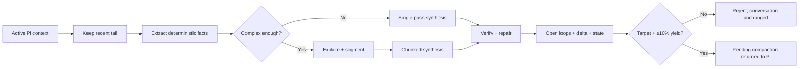

# Architecture

Maintainer-facing system design for **Pi Continuity**, published as the npm
package `pi-smart-compact`. The product name is documentation branding only:
the package name, `/smart-compact` command, `smart_*` tools, `smartCompact`
configuration key, runtime and UI names, stored paths and ref prefixes are
unchanged.

Usage lives in the [user guide](./docs/guide.md), every setting in
[configuration](./docs/configuration.md), and evidence rules in
[evaluation](./docs/evaluation.md). This page explains how the parts fit and
which invariants they must keep. Contributor workflow and the repository map
are in [`CONTRIBUTING.md`](https://github.com/alpertarhan/pi-smart-compact/blob/main/CONTRIBUTING.md).

**Contents:** [product layers](#product-layers) ·
[integration surfaces](#integration-surfaces) ·
[1. context hygiene](#1-context-hygiene) ·
[2. recoverable continuity](#2-recoverable-continuity) ·
[3. verified compaction](#3-verified-compaction) ·
[4. cross-session memory](#4-optional-cross-session-memory) ·
[state and persistence](#state-caching-and-persistence) ·
[concurrency and safety](#concurrency-and-safety-model) ·
[provider awareness](#provider-awareness) ·
[layer responsibilities](#layer-responsibilities) ·
[host dependency boundary](#host-dependency-boundary) ·
[extending the system](#extending-the-system)

## Product layers

> **Job:** keep the agent's working set useful and quiet, and keep the session
> continuous across research, cleanup, compaction, reload and, optionally,
> later sessions. Compaction and memory are mechanisms, not the product
> boundary.

Prefer cheaper, recoverable operations before lossy compaction when they fit
the task. This is a design preference, not an enforced execution chain: the
features can be selected independently, and memory does not require compaction.


```mermaid
flowchart LR
    H[1. Context hygiene] --> R[2. Recoverable continuity]
    R --> C[3. Verified compaction]
    C -. optional .-> M[4. Cross-session memory]
```

| Layer | Question it answers | Main modules | Core invariant |
| --- | --- | --- | --- |
| [1. Context hygiene](#1-context-hygiene) | How do we keep noise out of the working set? | `rtk.ts`, `app/tool-artifacts.ts`, `app/context-operations.ts` | Preserve protected content and retain retrieval paths for eligible offloaded output |
| [2. Recoverable continuity](#2-recoverable-continuity) | How does removed or old evidence stay reachable on the same branch? | `app/register-smart-context-tool.ts`, `app/context-evidence.ts`, `app/artifact-storage.ts` | Access follows active-branch provenance; the host session log stays authoritative |
| [3. Verified compaction](#3-verified-compaction) | How do we replace history when pressure demands it? | `app/run-smart-compact.ts`, `app/steps/*`, `phases/*` | Facts first, synthesis second, verification before apply; rejected custom summaries are not staged or applied |
| [4. Cross-session memory](#4-optional-cross-session-memory) | What should a later session know? | `app/memory-backend.ts`, `infra/context-graph.ts`, Hindsight and Mnemopi modules | One selected backend; explicit fact saves require confirmation, while enabled local indexing follows host-confirmed compaction |

Quality means retained constraints, trustworthy failure evidence and low
retrieval churn, not merely fewer tokens. There are no recurring
model-visible status prompts, no automatic error deletion, and no destructive
file rollback. The [2026-09-24 context hygiene report](https://github.com/alpertarhan/pi-smart-compact/blob/main/docs/reports/context-hygiene-2026-09-24.md)
(repository only, historical) records the original experiments and acceptance
criteria.

## Design ideas

- **Agentic compaction.** The system may inspect the session through bounded
  tools instead of summarizing a flat transcript.
- **Coverage across the whole conversation.** A design intuition borrowed from
  Greg Kamradt's public work on semantic chunking and long-context retrieval:
  important facts can sit anywhere in a long history, so an early constraint
  or a mid-session decision deserves the same chance to survive as the latest
  error. In this codebase that intuition shows up as deterministic extraction
  over the entire compacted prefix, topic-aware segmentation before
  hierarchical synthesis, and verification against the extracted facts
  regardless of where they occurred. It is not a formal sampling algorithm or
  benchmark result, and it is not a claim about how Pi's own compactor
  selects content.
- **EESV:** Extract, Explore, Synthesize, Verify. Facts first, synthesis
  second, verification last.

Verification measures coverage of deterministic facts, structure and grounded
claims. It is a strong regression guard, not proof of semantic truth, and a
compacted summary is not a lossless copy of the history it replaces.

## Integration surfaces

Registered in [`src/index.ts`](https://github.com/alpertarhan/pi-smart-compact/blob/main/src/index.ts).

| Surface | Lifecycle |
| --- | --- |
| `/smart-compact` | Manual command. A bare TUI invocation opens the keyboard Home (`ui/home-overlay.ts`); `Compact now` opens the target-first preflight. Direct arguments bypass Home. `trim` and `storage` expose the shared cleanup controller and the read-only storage inventory; `context` opens the session-navigation panel (`ui/navigation-overlay.ts`). Bypasses the adaptive pressure gate, not yield or verification gates. |
| `session_before_compact` | Auto hook. Returns or stages a pending summary, or runs under pressure; the durable commit waits for the matching `session_compact`. |
| `session_compact_failed` | Clears extension-owned staged state and records one error or cancellation outcome. |
| `turn_end` | Commits queued local context edits first; background mode tries bounded trimming before non-blocking speculative preparation. |
| `agent_settled` | Checks background preparation and requests native `ctx.compact()` at the idle pressure gate; does not commit itself. |
| `session_shutdown` | Cancels speculative work and awaits late preparation plus discard-metric writes; never applies an unconfirmed candidate. |
| `context` | Optionally rehydrates validated bitmap evidence beside the matching text summary; does not mutate session history. |
| `tool_result` | Opt-in early spill of large safe read-only text: verify persistence, then replace content with a preview and reference; errors leave the original result intact. |
| `before_provider_request` | Replays provider-native compaction state on a matching route; no I/O until the session has native state. |
| `before_provider_request` (anchor cache) | `app/anchor-cache.ts`: on Anthropic Messages routes, moves one `cache_control` marker to the newest anchor on the branch so the prefix before it stays cacheable while later turns change. |
| `session_before_tree` / `session_tree` | Own pivots supply the branch summary (carryover) for the exact prepared target; a foreign navigation cancels a queued pivot. Boundaries re-decide lazy tool exposure and refresh the anchor footer. |
| `smart_tools` tool | Agent-callable loader (`app/lazy-tools.ts`): `load`/`unload` one tool group (`navigation`, `history`, `memory`, `compaction`), `status`, or `guide` (reads `assets/skills/context-management/SKILL.md` on demand; never injected). |
| `smart_navigation` tool | `view`/`recall` anchors, `anchor` this point, or `pivot` to an anchor with required carryover; a pivot terminates the turn and is applied by the host only after the batch settles and revalidation passes. |
| `smart_compact` tool | Agent-callable. Prepares a pending summary; never compacts mid-turn. |
| `smart_context` tool | Session-local checkpoint/rewind, safe trimming, and bounded original-output retrieval via native boundary drafts. |
| `smart_recall` tool | Searches the selected memory backend only. `scope: "session"` is local-graph-only; remote backends skip it and read nothing else. |
| `smart_save_memory` tool | Saves a host-confirmed scrubbed fact through the selected backend, or resolves the exact store named by a target-bound ref. |

The table lists the owning surfaces. Other host events support them:
session switch/fork/tree and `model_select` cancel speculative
preparation and queued edits; `session_start` initializes replay, cache,
tool exposure, policy and navigation state;
`before_agent_start` injects the one-shot native continuity bridge;
`message_end` feeds damage monitoring and the host prompt-cache ledger;
`context_with_system` and `cache_warming_decision` serve held automatic trims
(see [recoverable trimming](#recoverable-trimming)); the RTK companion uses
`tool_call`.

Tool exposure is owned by `app/lazy-tools.ts`. The default `eager` mode keeps
permitted declarations stable from session start. Optional `lazy` exposes
`smart_tools` first; loaded groups reset at `session_start` and `session_tree`,
not `session_compact` (native kept thinking may still bind system/tools).
`off` removes all owned tools while the human UI keeps working. Group
permissions (`agentToolAccess`, memory backend, `contextNavigationEnabled`)
apply in every mode. The exposure removes only its own tools, restores only
what it removed itself, and treats a `/tools` change by the user as final:
hidden tools are never re-shown by a loader request. Artifact offload runs
only while `smart_context` is reachable (active or loadable), so an archived
output can always be read back by the agent that lost it.

`app/smart-compact-policy.ts` keeps agent-tool visibility separate from
automatic compaction. The tool remains registered for immediate re-enable, but
Pi's active-tool set controls whether its schema and guidance reach the agent.
Agent access is tri-state: `inherit` leaves host `/tools` and allowlists in
control, while explicit `enabled`/`disabled` mutate only `smart_compact` and
then report the effective host state. Policy snapshots are custom branch
entries restored on `session_start` and `session_tree`; the manual command is
never gated.

### Home, presets and readiness

`ui/home-overlay.ts` shows five rows: **Compact now**, **Clean up tool
output**, **Settings**, **History & recovery**, and **Status & help**. Context
and the effective automatic/agent policy stay visible above the list.
Compact-picker cancellation returns to Home; no menu-open path changes
settings.

`ui/profiles.ts` derives presets from exact persisted flags. Behavior presets
are **Manual only**, **Manual + agent**, **Cleanup only** and **Fully
automatic**; the built-in defaults, which match none of them, are labeled
**Pressure-first (default)**. Summary formats are **Verified text**, **Text +
images** and **Provider (experimental)**; provider output needs a second
confirming Enter, and capacity-ineligible models cannot be selected. Fully
automatic selects the `settled` strategy. Presets atomically patch existing
keys; existing settings are never migrated, and branch overrides stay separate.

`app/effective-state.ts` gives Home (`Status & help → Readiness & details`),
preflight, metrics and dashboard one local-evidence view. It resolves routes,
reports credential presence without calling `getApiKey`, checks local backend
prerequisites and reads pure runtime state. It never refreshes OAuth, probes a
provider or server, creates a store or acquires a lease. Pi's effective
auto-compaction setting is not available through the public extension API, so
for `native-hook` that prerequisite is reported as unknown. Memory readiness is
informational: an unready optional backend warns but never blocks compaction.
`app/model-feasibility.ts` may disable model rows from a local estimate of the
planned stage requests; it never refreshes credentials.

Preflight and result overlays size their own viewports from terminal rows,
because Pi 0.87.1 renders overlays with `render(width)` and no height. Actions
stay outside scrolling content. Result approval is explicit (`A` only);
technical details are opt-in, while verification and fallback warnings stay
visible.

## 1. Context hygiene

Hygiene keeps the working set small before summarization is needed. It never
calls a model.

### Command hygiene (optional RTK companion)

`src/rtk.ts` is a separate entry point, absent from `pi.extensions`. It
delegates rewrite rules to the external RTK binary and never executes the
original command itself. Eligibility is only bare `git status`, `cargo test`
and `bun test`, tested against RTK 0.50: `bun test` joined after a paired
native/filtered runner check showed exit-code and failure/load-error parity
plus full recall of the filtered output, with one execution; `git diff`, `tsc`
and vitest 5 measured lossy or growing, and `npm test`/`node --test` have no
rule. Arguments, unknown syntax/flags and compound commands pass through.
Missing binary, unknown version, cancellation, session invalidation and CLI
failure all retain the input. The host bash tool keeps execution and result
ownership. No retries or output rewrite hooks are added. Permission hooks must
run after this input mutation. RTK's recall store and retention are not Smart
Compact artifacts and are not covered by its scrubbing.

### Early tool-output artifacts

`artifactOffloadEnabled` defaults to false. `app/tool-artifacts.ts` handles
`tool_result` before the next model request, using the shared conservative
read-only allowlist. Errors, images, commands, mutations, unknown tools,
instruction/skill reads, file/symbol read deliveries (`read`, `read_symbol`,
`read_enclosing`) and the extension's own recovery tool stay inline. File reads
are excluded until read guards can honor actual delivered coverage rather than
the original call's implied full range. Earlier hooks' content is the capture
boundary; no arbitrary full-output path is read. Native details and status are
preserved.

After scrubbing, text of 16k+ characters (maximum 2 MiB) is content-addressed
in a session-origin directory under `smart-compact-artifacts/`, separate from
disposable caches. Async atomic-write and cross-process lock helpers protect
writes and quota checks. The final file is read back with bounded I/O, size and
SHA-256 verification before a preview is returned. Directory symlinks and file
symlinks/hardlinks are rejected. Storage, cancellation and quota failures are
fail-open for the original result and are never advertised as recoverable
output.

A small `details.smartCompactArtifact` record carries scope/content/preview
hashes, size, tool and source description. Only active-branch provenance
authorizes lookup; a content/preview mismatch or unowned context edit revokes
recovery. Forks may retain their parent reference; they do not duplicate
files. Files are not expired or evicted while refs may exist: 256 files/32 MiB
per origin is a stop-spilling quota, not LRU. Global usage across sessions is
not capped. Explicit cleanup must account for dependent forks; missing evidence
is an error, not a live-file reread. Interrupted writes can leave unreferenced
files charged against that origin's cap. Branch authorization is indexed by
entry ID, not content hash, so byte deduplication cannot overwrite source
provenance. The catalog collapses only repeated (tool, source label, payload
hash) rows; distinct labels share the hash read alias and keep direct entry-ID
retrieval. Foreign edits revoke the affected occurrence, not independent
references. No new on-disk format or migration is involved.

### Recoverable trimming

`app/context-operations.ts` plans edits against native
`buildSessionProjection()`. `app/register-smart-context-tool.ts` queues one
mutation and returns drafts from `turn_end`, only after a successful
originating tool result, on the same branch, with no competing drafts or
pending user input. The native host owns persistence; there are no mid-tool
session mutations, tree-navigation hacks, or summarizer calls.

`requestManualTrim` on that controller backs both `/smart-compact trim` and the
Home **Clean up tool output** row. Queueing performs no model call and forces
no turn, so the next provider request is still sent untrimmed and the queued
edit applies at the next natural completed-turn boundary. A pending return to
an anchor or newer boundary change cancels it with a visible message.

Trimming protects four recent assistant turns and the active checkpoint prefix,
replacing up to 32 old read-only results of at least 4096 characters with a
bounded reference marker. Already-edited entries are not rewritten. Automatic
trimming runs with `contextHygieneEnabled` independently of compaction, or with
the effective `background` strategy, and requires `smart_context` reachable
by the model (`canAutoTrim` checks it like artifact offload does).
`plan` gives an on-demand non-mutating preview. Automatic batches require at
least 16,384 net saved characters and eight assistant turns since the last
owned trim/rewind/compaction; branch history supplies that cooldown across
reloads and forks. At a completed, uncontested turn boundary a ready batch
commits with cause `pressure` (early pressure gate reached) or `break-even`
(catalog prices say it pays back within `AUTO_TRIM_BREAK_EVEN_REQUESTS` = 24
requests). Otherwise it is held (`deferredTrim` in `smart_context` status):
once the prompt cache has expired, `context_with_system` sends the trimmed
results request-locally, byte-identical to the future `context_edit`, and the
edits commit with cause `cold` at the next completed turn. While a batch is
held, `cache_warming_decision` may stop Pi's cache warming when a refresh no
longer pays. Unknown prices allow only `pressure` and `cold`. The formula and
drop conditions are in [configuration](./docs/configuration.md);
`app/host-cache-ledger.ts` attributes observed prefix rebuilds. These are
catalog-price estimates, not measured cache billing. Manual and agent trims
commit at the next boundary with cause `manual` or `agent`; explicit trim
bypasses batching, not safety.

Instruction and skill sources stay inline through trim, rewind, artifact,
bitmap and pre-compaction pruning; recovery tool output is not recursively
re-archived. Pre-compaction dedup requires identical text content plus
arguments and no intervening changed observation or unsafe operation.
Unproven status-looking user text is never a deletion signal. Hygiene yields to
existing EESV work and staged candidates. Its handler precedes background
observation, and projected edits in the accumulated drafts prevent speculative
work from capturing a stale pre-edit branch. Explicit edits cancel background
work and invalidate the shared pending slot. Context fingerprints and
compaction guards prevent removed evidence from being resurrected.

## 2. Recoverable continuity

Continuity means the session can find what it needs again on the same branch,
across reloads and forks, without copying the transcript to a second store.

### Checkpoint, rewind and archived output

Small `custom` records (`smart-compact-context`, version 1) hold one active
checkpoint and lists of archived output IDs. Status is rebuilt from active
ancestry on demand, including after reload; these records do not enter model
context. A checkpoint captures session/origin IDs and a projected-prefix
fingerprint. New user messages, an intervening compaction or branch summary, or
a changed prefix invalidate it. The agent-written handoff is a bounded
`custom_message`, not an authoritative user instruction or an EESV
verification result.

A conservative read-only tool allowlist plus shared nested-call normalization
protects side effects. Rewind removes only whole successful, complete,
text-only read exchanges and successful assistant prose after the checkpoint.
Mixed batches, errors, commands, writes, unknown tools and image results stay
raw. Context edits omit messages in the projection, not in session history. The
mutation cap is 512; no partial rewind is applied when it is exceeded. Files
and processes are untouched.

Reference retrieval is restricted to this extension's branch-local archive
records and original textual tool results; foreign context edits revoke access
until an owned archive record explicitly re-authorizes it. Assistant reasoning
and arbitrary entries are never exposed. Full text is scrubbed before a bounded
page is sliced, avoiding cross-page credential reconstruction.

### Evidence search

`app/context-evidence.ts` unifies native-history refs, bounded visual excerpts
and artifact files behind `smart_context`. Source descriptions and bounded
literal search make old evidence discoverable without knowing its ID.
Native-history labels use the shared `extractToolPath` alias rules. Search
checks at most 32 sources/4 Mi characters and returns at most ten
first-per-source matches plus a continuation cursor; no source bodies are
injected just to list them. Read supports character or line selection and a
4096-character response cap. All representations are re-scrubbed in full
before searching or paging. Context, recovery and compaction see only the
stored preview; full files are retrieved only on explicit agent calls.

### Storage inventory

`app/artifact-storage.ts` backs `/smart-compact storage` with a strictly
read-only inventory of the spill store. It streams every `*.jsonl` under the
native sessions root with bounded memory and classifies each origin directory
against two lineage anchors that only Pi maintains: session headers
(`sha256(id)` = owner scope) and `details.smartCompactArtifact.owner`
references that forks copy. Outcomes are `live`, `unreferenced-in-scan`, or
`unknown` when the scan is incomplete. `unreferenced-in-scan` is deliberately
not safe-to-delete: sessions outside the scanned root are undiscoverable, and a
running session can add references after the scan. That is why no `--clean` or
artifact GC exists; `ui/storage-report.ts` renders totals, status, bytes and
retention without deletion verbs. Durability tests age real `SessionManager`
artifacts past 20 days by timestamp (deterministic, not a wall-clock soak),
reload and fork through the public consumer, fail closed on missing or tampered
bytes, and hold the per-origin caps without losing earlier evidence.

### Session navigation and apply-time validation

`app/register-navigation.ts` owns anchors, cross-session recall, pivots, the
anchor footer and the Anthropic anchor cache marker (`app/anchor-cache.ts`).
`app/navigation-data.ts` reads both owned anchors (`custom_message` entries of
type `smart-context-anchor`, plus `smart_navigation` tool results) and legacy
`context` tool anchors; recall scans other sessions' JSONL read-only.

Agent anchors require the shared early pressure gate by default. An anchor
requests one safe consolidation through `smart_context`'s existing queue;
only its new region can be trimmed before first replay. Previous anchor and
checkpoint prefixes stay protected. Append-only anchors do not invalidate a
prepared summary; ready/running compaction takes priority over agent cleanup.
Human commands bypass pressure gates, not safety checks. Selective trim/rewind
fail closed if they would change history before retained signed Anthropic
thinking. Byte-identical thinking alone does not preserve its prefix binding.

A human anchor is a `sendMessage` custom message followed by a native label on
that entry; a human pivot navigates to the label so Pi's `custom_message`
handling cannot drop the anchor text. An agent pivot is queued by the tool,
revalidated at `turn_end` (uncontested successful batch, same session, same
leaf, permission unchanged), dispatched at `agent_settled` through a nonce-bound
`/smart-compact` apply command, and supplied to `session_before_tree` as the
branch summary. New input, a session switch, a foreign tree navigation or a
permission change cancels it with a visible notice. While a pivot is queued or
applying, `session_before_compact` returns `{ cancel: true }`, automatic
preparation stops, and both new and queued `smart_context` mutations are
refused; evidence reads keep working. Files, processes and Git state are never
rolled back.

Reader identity and limits are captured before preparation starts.
`revalidatePending` checks that snapshot, the active projected prefix, current
usage/growth, native reserve, response headroom, target and yield for
foreground and background candidates. New compact instructions invalidate old
staged work. Navigation and model events clear speculative, pending and
staged-commit candidates; a generation guard rejects late native-hook work if
invalidation happened during its provider call. Pi remains the apply owner.

### Continuity state across compactions

After a confirmed compaction, `utils/state.ts` carries structured state
forward: open loops, a continuity ledger in which prior facts persist until
positive resolution evidence or an explicit override, non-destructive goal
breadcrumbs, and a "Changes Since Last Compaction" delta. Snapshots are scoped
to project, session and branch head; see
[state, caching and persistence](#state-caching-and-persistence).

Same-question decisions keep the latest non-empty answered record, including
its provenance; an unanswered re-ask does not erase the prior answer. Fallback,
verification and state merging share this selection rule. Automatic constraint
retirement uses bounded recognition of explicit releases, not general
natural-language entailment: question, report and denial forms are not grants.

## 3. Verified compaction

### Automatic strategies

`autoTrigger` gates every automatic path; with it off, neither `settled` nor
`background` runs and the native hook does not replace Pi's summaries. Pi's own
compactor is not affected. Hygiene can still run.

- **`native-hook`** is passive. It participates only when Pi starts
  a compaction; its percentage setting is a minimum replacement gate, not a
  scheduler, and Pi auto-compaction must itself be enabled for host-driven
  runs.
- **`settled`** (default, 80% apply gate) applies finite token/percentage, queue, in-flight and
  per-session cooldown guards at idle `agent_settled`, then asks Pi for a
  normal host compaction. Every finished attempt, including callback errors,
  synchronous throws and watchdog expiry, starts the cooldown; late callbacks
  cannot reset it or change a newer request's state. Pi re-enters `session_before_compact`, which reuses an
  already tool-staged summary or runs EESV exactly once under the host's signal
  and timeout. `session_compact` stays the only durable commit authority;
  `session_compact_failed` discards the candidate. This keeps proactive
  triggering out of the pending/commit state machine and preserves
  branch-provenance checks. Watchdog expiry is not a host cancellation: a busy
  host is reported as pending without manual-retry advice, and late completion
  remains valid.
- **`background`** (opt-in, `app/background-preparation.ts`) snapshots branch,
  model, session, system prompt and usage before asynchronous work. Effective
  tool definitions are fingerprinted and checked again before use. `prepareContextPercent` sets an
  independent early gate with the existing minimum token floor; null preserves
  `applyTokens - clamp(floor(applyTokens * 0.125), 8192, 32000)`. An explicit
  prepare percentage must be below the effective `minContextPercent` apply gate.
  Only pipeline admission is lowered; targets, yield and apply-time safety are
  unchanged. A private pending slot isolates cancellation from foreground
  staging. One task, a ten-minute attempt cooldown and configured `pendingTtlMs`
  (default five minutes) bound speculation. Model/system/tool/config changes, branch navigation, new compaction or
  context edits, switch/shutdown and native compaction invalidate unfinished
  work, and late completion cannot publish after cancellation. Before reuse, a
  content fingerprint proves the captured prefix is unchanged; appended tail
  growth must still satisfy the verified target, minimum yield and response
  reserve.

`contextPressure` supplies execution, status and TUI with the same policy window
and early/apply gates (288k/320k for a 400k window at default 80%). Roomy history
stays unchanged by default; `contextPressureOnly: false` opts into legacy
break-even/cold-cache hygiene. Metadata checkpoints and first-delivery offload
are independent of old-prefix pruning. Cleanup commits before preparation can
snapshot it, and later compaction observes Pi's updated projected usage.

Preparation never waits inside `turn_end`. Proactive application waits for
idle `agent_settled`; an ongoing tool loop relies on Pi's native maintenance
boundary. No boundary draft bypasses the `session_compact` commit protocol. The
native hook falls back normally if speculative work is unavailable. Completed
discarded preparation emits one cost-only record with reason and ready/wait
timing, never an applied outcome. Shutdown cancels and drains tracked work and
writes so late completion cannot lose its accounting on graceful exit.

A short-lived pending compaction is staged in the
[`PendingSlot`](#pending-compaction-slot) and handed to Pi when compaction is
applied.

### Pipeline at a glance


```mermaid
flowchart LR
    A[Active Pi context] --> B[Keep recent tail]
    B --> C[Extract deterministic facts]
    C --> D{Complex enough?}
    D -- No --> E[Single-pass synthesis]
    D -- Yes --> F[Explore + segment]
    F --> G[Chunked synthesis]
    E --> H[Verify + repair]
    G --> H
    H --> I[Open loops + delta + state]
    I --> Y{Target + ≥10% yield?}
    Y -- No --> X[Reject; conversation unchanged]
    Y -- Yes --> J[Pending compaction returned to Pi]
```

The orchestrator ([`src/app/run-smart-compact.ts`](https://github.com/alpertarhan/pi-smart-compact/blob/main/src/app/run-smart-compact.ts))
threads a typed context through ten stages:

| # | Stage | Module | Transition |
| ---: | --- | --- | --- |
| 1 | prepare | `app/steps/prepare.ts` | config + provider caps + budgets; auth remains lazy |
| 2 | window | `app/steps/window.ts` | pick the prefix using a calibrated final-summary allowance |
| 3 | recover | `app/steps/recover.ts` | restore log-truncated messages |
| 4 | tier | `app/steps/tier.ts` | admission gate + none / light / full pressure label; mode owns strategy |
| 5 | extract | `app/steps/extract.ts` | prune + deterministic extraction + cache |
| 6 | synthesize | `app/steps/synthesize.ts` | single-pass or EESV |
| 7 | verify | `app/steps/verify.ts` | structural verify + repair; high-risk outcomes require successful tool evidence |
| 8 | state | `app/steps/state.ts` + `domain/yield-gate.ts` | state/open loops/resolved history/delta + final yield proof |
| 9 | persist | `app/steps/persist.ts` | stage pending, apply compaction |
| 10 | metrics | `app/steps/metrics.ts` | success / failure record |

`app/steps/visual.ts` may run after verification when the experimental
[visual evidence](#experimental-visual-evidence) path is enabled.

### The typed stage machine

[`src/app/run-context.ts`](https://github.com/alpertarhan/pi-smart-compact/blob/main/src/app/run-context.ts) models the pipeline
context as a state machine of branded intersection types. Each step accepts the
previous stage type and returns the next, so reordering or skipping a step is a
compile-time error:

```text
RcBase
  → PreparedRc      (after prepare)
  → WindowedRc      (after window)
  → RecoveredRc     (after recover)
  → TieredRc        (after tier)
  → ExtractedRc     (after extract)
  → SynthesizedRc   (after synthesize)
  → VerifiedRc      (after verify)
  → StatedRc        (after state)
```

Each stage adds a `_prepared` / `_windowed` / … discriminator that carries the
type-level proof and is checked by `advance()` at runtime. A step mutates its
input and casts it to the next stage (no per-step copy of ~30 fields). The
final alias `RunContext = StatedRc` lets `applyCompaction` read `rc.details`
with no non-null assertions: the type system proves `buildState` has run.

### Entry, modes and routing

`src/index.ts` owns host lifecycle wiring. `app/register-smart-compact-command.ts`,
`register-smart-compact-tool.ts`, `smart-compact-input.ts` and `model-routing.ts`
validate input, resolve models and route work into `runSmartCompact()`. Before
expensive work, context size is checked against the thresholds in
`src/constants.ts`. Auto and tool runs are skipped while context is small;
manual `/smart-compact` uses an absolute adaptive safety tail rather than a
percentage of large model windows.

`app/preflight.ts` builds the decision card from the same config snapshot,
calibrated estimator, adaptive profile, active branch and pure window planner
as execution. It compares exactly Fast, Balanced and Thorough; `M` changes the
summary route and replans all three, and `D` reveals estimator/boundary
details. A plan must meet the tail target and at least 10% projected net
savings before any model call. A pending summary for the same session is reused
instead of running the pipeline again. `auto` is a selector, not a fourth
policy (`app/mode-policy.ts`): it chooses one of the three from context pressure
and deterministic extraction risk. Legacy `aggressive` maps to Fast.

Model routes are stage-specific and never inferred from mode. With no explicit
configuration, Explore, Synthesize and Verify use the selected Pi model;
`segmentationModel`, `summaryModel` and `verificationModel` override them
independently. `app/stage-auth.ts` checks credential availability just before
each stage's first network call and reuses the answer for equivalent routes;
the session runtime resolves the actual auth per request, and call metrics
keep the actual route. How routing evidence is gathered is described in
[evaluation](./docs/evaluation.md#provider-routing-evidence).

### Keep window and preprocessing

`app/steps/window.ts` reads the selected ancestry via `getBranch()` and passes
it to native `buildSessionProjection()`, never converting raw entries
individually. `contextMessageEntries()` converts that projection with
`convertToLlm()`, keeping source IDs and host-visible custom, branch and
compaction summaries while honoring `context_edit` replacements and omissions.
Intentional edits are marked against raw-log recovery. The active view drives a
content-free `CompactionWindowPlan` from the selected mode budget:

- **hard `toolCall` / `toolResult` guard**: never orphan a result from its call;
- **soft recent-user/checkpoint/topical preferences**: keep raw only when the
  suffix still fits the planned budget;
- **yield contract**: the projected replacement must meet its target and save
  at least 10% after reserving the summary budget.

A relaxed soft boundary is recorded rather than silently overriding the
target. Long turns may be summarized through their older prefix; a cut inside a
tool exchange either keeps the complete pair within budget or advances past it.
The planner also advances past complete historical exchanges whose tool names
violate the portable provider contract, so model switches cannot expose an
unsendable raw tail. If no provider-safe hard boundary meets the target,
automatic and tool runs normally return control to Pi's native compactor before
any LLM call. An already-overflowed context is the exception: measured usage is
mapped across active messages and EESV keeps chunked recovery instead of
sending an oversized one-shot prompt. Manual runs use the profile's absolute
adaptive tail, so model-window size cannot turn an explicit command into a
full-context no-op.

Before summarization the pipeline keeps a deferred reference to the recovered
pre-prune messages, prunes redundant messages, loads prior continuity, checks
the extraction cache and loads the project fingerprint. Synthesis and backup
text use `serializeConversationText()` without the host summarizer's implicit
2,000-character tool-result cap. Structural and text redaction stay enforced;
binary attachment archival is outside this format. The backup is materialized
and written atomically only after the matching native compaction is confirmed.

### Extract

[`src/utils/extraction.ts`](https://github.com/alpertarhan/pi-smart-compact/blob/main/src/utils/extraction.ts). Zero LLM calls.
Deterministically pulls modified/read/deleted files, tool and bash-like errors,
retry/resolution signals, explicit and implicit decisions, constraints and
preferences, heuristic topic segments, timeline events, the main goal and open
loops across the whole compacted prefix. This is the ground truth that
synthesis and verification trust. Dialog answers follow tool-call IDs rather
than a fixed next-message window. Fresh extraction and cached reconciliation
share retry-result classification and inspect later/sibling retries; a false
`isError` flag cannot turn an error-bearing command result into success.
Self-notice filtering distinguishes a standalone user rule from that phrase
inside an attributed Smart Compact warning.

### Explore

[`src/phases/explore.ts`](https://github.com/alpertarhan/pi-smart-compact/blob/main/src/phases/explore.ts). Runs only in `thorough`
mode or when `auto` selects it from deterministic risk. The model inspects the
conversation through a small toolset: message ranges, conversation search,
recent user messages, local context around an index, file-change lookups and
error chains. Tool support is probed once and cached per run; without function
calling the system falls back to a direct structured analysis. The tool
conversation is capped at three rounds, each response is capped where the
provider supports output limits, and the shared prefix uses short-lived prompt
caching. Every exploration path leaves two calls for batch synthesis and final
assembly; with two or fewer calls remaining it uses deterministic boundaries.

### Synthesize

[`src/phases/synthesize.ts`](https://github.com/alpertarhan/pi-smart-compact/blob/main/src/phases/synthesize.ts). Three paths:

- **Deterministic zero-call** for high-confidence Fast extractions.
- **Single-pass** when the compacted conversation fits under the configured
  threshold.
- **Hierarchical** for larger sessions: merge available boundaries, split
  oversized semantic chunks, batch by token budget, summarize batches,
  assemble. Every batch is summarized, so coverage does not depend on a
  fragment's position in the history.

Session-aware prompting, decision propagation across later batches,
mode-specific thresholds and output limits, provider-aware wave concurrency,
aggregate prompt-token reservation and deterministic fallback assembly when any
budget or LLM call fails. Batch retries and queued workers recheck remaining
calls before dispatch so they cannot spend the final assembly call.
Single-pass and final assembly reject known nonterminal stop reasons and
unclosed Markdown fences before the synthesis cache can retain the result.
Their existing error paths use deterministic fallback, without extra retries
or enlarged budgets.

### Verify

[`src/phases/verify.ts`](https://github.com/alpertarhan/pi-smart-compact/blob/main/src/phases/verify.ts) scores the summary against
deterministic extraction, continuity, explicit focus/note steering and source
messages. It checks missing modified/read/deleted files, unresolved errors,
high-confidence constraints, weak goal coverage, missing structure, suspicious
fabricated paths, done/unresolved inconsistencies, explicit decisions, open
loops and unsupported high-risk outcome claims. Claims such as "tests passed"
need matching source prose or a successful related tool result.

Explicit decisions are question–answer units, not independent bags of words:
short/symbolic/numeric answers retain their identity, and one question cannot
borrow another question's answer. Answer polarity is separate from the
question's wording. A conflicting answer is an inconsistency that cannot be
repaired by simply appending the expected answer. These deterministic checks
remain bounded heuristics, not a proof of arbitrary prose equivalence.

Repair order is intentional: (1) deterministic patch first (free, idempotent);
(2) one LLM patch only in `thorough` mode if still insufficient; (3) replace
lower-scoring output with a deterministic quality floor built only from
extraction, continuity and steering; (4) reject unless final verification has
no gaps and meets the verified threshold. Untrusted chunk prose never feeds the
quality floor. Final verification runs again after continuity injection. The
final scalar is reported as repaired **verification coverage**, alongside the
pre-repair score and fallback provenance, never as raw synthesis quality.
Failures keep only exhaustive content-free gap kinds and the rejecting gate
(`post-synthesis` or `post-state`) in local telemetry. Summary-derived
continuity fields cannot become evidence for their own initial verification.

Polarity checks are symmetric: adding negation to a positive fact is rejected
just as removing negation from a prohibition is. Short negation tokens such as
`no` survive token filtering. Verbatim source clauses are not compared against
the whole instruction's polarity, while additional contradictory clauses stay
checked. Exact grounded path representations are not outcome claims; prose in
file sections is still verified. Synthesis and post-state verification use the
same summary budget for path encoding. Unresolved-error snippets and
fallback-rendered evidence share `summaryEvidenceLine()`, so Markdown prefixes
and wrapping cannot create false missing-error gaps. Fallback constraints keep
the full extraction bound (`TRUNC.CONSTRAINT_TEXT`, 300 characters) without a
second preview cut or category label, because decorating or shortening a
faithful compound instruction can defeat exact-source matching.
`domain/keywords.ts` supplies the shared salient-keyword check used by
verification and damage detection.

### EESV hardening and control surfaces

- **Canonical summary IR** accepts recognized H1/H2/H3 headings outside fenced
  code, preserves Progress subsections, and merges duplicate canonical kinds
  before state mutation.
- **Typed verification gaps** drive mandatory deterministic repair;
  collision-aware path needles prevent basename cross-satisfaction.
  Provenance and normalized semantic evidence are indexed once per pass, and
  truncated or delimiter-incomplete LLM patches are rejected. Provenance is
  persisted and shown before optional approval.
- **Fine tool semantics** separate read/search/list/mutate/delete/execute.
  Pruning deduplicates only identical idempotent access signatures.
- **Unified token planning** uses a run-bound estimator with bounded
  process-shared provider/model calibration, counts structured tool-call
  arguments, keeps an adaptive recent tail, targets mode-specific
  post-compaction headroom, reserves bounded post-summary state sections,
  clamps every request to the model's advertised output limit, and reconciles
  every request against aggregate prompt/output caps. Missing provider usage is
  estimated conservatively. Tool exchanges stay atomic; oversized result bodies
  are head/tail bounded only for synthesis, after full deterministic
  extraction.
- **Per-dispatch capacity revalidation** (`domain/model-capacity.ts`) never
  compares the whole conversation to a stage model's window: `trackedComplete`
  estimates each actual serialized request, with output clamped to the model's
  limit and Pi-AI's 4,096-token safety margin, and throws an actionable
  `ModelCapacityError` before the provider is contacted. UI feasibility rows are
  advisory snapshots; sizes that only exist after generation rely on this
  runtime guard.
- **Security boundaries** recursively scrub structured messages before host
  serialization or provider calls, redact secret-bearing primitive values, and
  scrub plus hard-cap exploration tool feedback. PII scrubbing is opt-in.
  Backups stay unmaterialized until confirmed apply.
- **Policy controls** include focus weighting, exact call/latency budgets,
  default fail-closed manual approval, online damage monitoring and persisted
  open-loop overrides. Interactive review time is outside the pipeline
  deadline.
- **Release gates** (`bun run gate`, `bun run bench`) cover adversarial parser,
  verification, tool, cache, budget, scrub and damage fixtures plus bounded p95
  regressions for extraction, pruning, chunking, summary parsing and path
  matching.

### Provider-native compaction engine

Provider-native compaction is an optional engine on stock Pi, using public
extension APIs only. Pi 0.87.1's adapters do not parse or replay signed
Anthropic blocks or opaque OpenAI items, so this extension does both:

- `run-smart-compact.ts` runs the `compactionEngines` list after the window
  step. Each engine is `applied`, `skipped` or `failed` (`EngineAttempt`); all
  share one provider-call budget; if none applies, `EngineChainError` lists
  every outcome and nothing is staged. The default list is `["eesv"]`.
- `app/native-compaction.ts` gates on `isNativeApi(ctx.model.api)` and uses only
  the current session model. It moves the cut back to a clean turn boundary
  (kept tail starts at a user message, prefix ends with a completed assistant
  reply, no open tool call).
- Request: one nested `ctx.modelRegistry.streamSimple(model, { systemPrompt,
  messages, tools }, { fetch, transport: "sse", maxRetries: 0, signal,
  sessionId })`. Active tools are included because Anthropic rejects tool_use
  history without them. Pi's adapter builds the ordinary request; the `fetch`
  from `infra/native-protocol.ts` (`createCompactionFetch`) rewrites it into the
  provider's compaction request, sends it once and answers Pi with a
  non-retryable 400. Without a result no request was sent and Pi's error is
  reported literally. A prefix that starts with an earlier native compaction of
  the same route replays that state (`prior`); failure to replay aborts before
  the provider call.
- Codex `response.incomplete` is a failure even if an item and usage arrived.
  Results and persisted state require a signed Anthropic compaction block or
  OpenAI compaction items with encrypted content; the opaque bytes are
  preserved, not cryptographically verified locally. Results are also rejected
  for another route or when not smaller than the prefix estimate. Accepted
  state is staged in the ordinary pending slot and stored only in
  `details.native` (`NativeState`, validated with `isNativeState` on every
  read).
- Replay: `before_provider_request` takes the latest compaction entry on the
  branch; if its `details.native` matches the current api/provider/model,
  `replayNativeState` returns a payload copy replacing only Pi's exact wrapped
  summary. A bare substring match never authorizes replay. When replay is
  impossible on a matching route, OpenAI routes get a one-time warning per entry
  and Anthropic is recorded only. The hook does no I/O and does not walk the
  branch until the session has native state (a flag recomputed from in-memory
  entries at `session_start`, `session_tree` and `session_compact`).
- Details record `method: "native"`, `nativeApi` and the engine attempts;
  notices never claim EESV verification for native state.
- Requests made by the extension itself (EESV stages and the native
  compaction body) go through the requesting session's public model runtime
  (`ctx.modelRegistry.stream`/`streamSimple`, `infra/llm-client.ts`), never
  pi-ai's standalone completers. The runtime applies request-time auth and any
  provider registered by another extension with `pi.registerProvider`, such as
  the separate `pi-claude-oauth-adapter`; stock Pi still skips
  `before_provider_request` for these requests, so an adapter must normalize
  the final payload inside its own provider (the published `0.2.2` does not;
  [upstream PR #10](https://github.com/minzique/pi-claude-oauth-adapter/pull/10)).
  Caller `apiKey`/`headers` are stripped so an explicit key never bypasses
  stored OAuth; `app/stage-auth.ts` is an availability preflight only. The
  Anthropic prior-state replay runs in the caller's `onPayload` before any
  adapter normalization, and the final on-demand request drops
  `context_management` because Anthropic prohibits combining it with
  on-demand compaction.

`test/native-compaction-compat.test.ts` pins what stock adapters drop by
themselves. The design research and measured runs are in the
[2026-09-24 research report](https://github.com/alpertarhan/pi-smart-compact/blob/main/docs/reports/hindsight-native-compaction-research-2026-09-24.md)
(repository only, historical).

### Experimental visual evidence

`visualArchiveEnabled` defaults to false. After `buildState` has verified text
and post-compaction yield, `steps/visual.ts` may add a bounded supplementary
archive. It reuses the conservative read-only tool-batch selector, skips
intentional context edits, and scrubs text before clipping and rendering. A
Latin/Turkish glyph scope, at most eight 3k-character excerpts, two 1280-wide
pages (74 rows each) and 1 MB total PNG bytes bound local work. Oldest whole
excerpts are dropped until the image allowance plus reading guide fits both the
original target and response reserve. Representation comparisons use a
reader-bound estimator from the shared calibration store; summarizer
accounting stays separate. The yield gate runs again, and any failure keeps the
unchanged text. This does not avoid the EESV call or promise cheaper
compaction.

The optional resvg renderer is imported only on demand, uses one shipped
licensed font with system-font discovery disabled, and receives only
XML-escaped text in a fixed generated SVG, with no user-controlled SVG,
resource paths or URLs. It is external to both bundles; Node loads the default
extension without it. Rendering uses the run's abort signal plus a five-second
cancellation limit, with a fresh composed signal per page because resvg's
native abort binding cannot be reused.

`SmartCompactDetails.visualArchive` stores versioned bounded source excerpts
and PNGs in the native compaction entry; no file cache or second transcript
store is created. Later hybrid compaction re-renders source text, never OCR.
`context` validates frame bounds/signatures, source ancestry and revocation,
reader route, privacy, summary identity and request headroom, then inserts a
request-local custom image message; it never replaces the verified text
summary. Changing model/provider/API or using a text-only model withholds
images; stricter scrubbing also withholds old pixels that cannot be
retroactively redacted. Only the latest compaction's archive is eligible, and
native fallback can discard it. Metrics record only visual token estimates and
frame counts. The [2026-09-24 visual pilot](https://github.com/alpertarhan/pi-smart-compact/blob/main/docs/reports/visual-pilot-2026-09-24.md)
(repository only) is a dated single-model synthetic sample, not production or
cross-model accuracy.

## 4. Optional cross-session memory

Memory is exactly one selected backend at a time (`app/memory-backend.ts`):
`local`, `hindsight` or `mnemopi`. The selected backend is the only store read
or written. With Hindsight or Mnemopi selected, the local context graph is
neither indexed by compaction nor consulted, no local copy exists, and inactive
stores are preserved untouched. Hindsight means the user's existing configured
server; nothing installs or starts one. Continuity state, backups and artifact
spill are session mechanisms outside this choice. Manual saves require host
confirmation of the complete scrubbed content. Only the local backend also
indexes derived facts, and only from apply-confirmed compactions; remote
backends receive nothing automatically.

- **Local** (`infra/context-graph.ts`): project-partitioned SQLite FTS5 facts
  and file edges, indexed from apply-confirmed compactions plus confirmed
  manual memories. Details are in
  [state, caching and persistence](#state-caching-and-persistence).
- **Hindsight** (`app/hindsight-memory.ts`, `infra/hindsight-client.ts`,
  `infra/hindsight-receipts.ts`): four fixed routes (retain, status, recall,
  delete one document), no generic request, origin/bank/project-scoped receipts
  that never evict unconfirmed operations. Data flow, consent and receipt states
  are in [Hindsight memory backend](./docs/hindsight-memory.md).
- **Mnemopi** is an optional Bun-only dependency, never imported by the Node
  host. `app/mnemopi-memory.ts` starts a bounded worker and waits for a
  readiness line after its imports before sending any content over stdin.
  `resolveBunExecutable()` resolves the worker runtime read-only: the
  optional `bun` component installed beside the extension first (manifest bin
  plus a real-file check that rejects the postinstall placeholder), then the
  platform `@oven/*` package, then a supported PATH Bun (>=1.3.14). No shell,
  download or self-install is involved, so missing components fail before a memory
  request; interrupted submitted writes remain uncertain. TypeBox validates both
  IPC directions and persisted engine metadata. Project-isolated files,
  author/kind filters and checked provenance prevent cross-project recall. The
  cross-process lock covers identity lookup and mutation through child exit;
  Mnemopi manages its own SQLite transactions. Stable per-fact engine sessions
  make duplicate saves and metadata-id resolution work without a sidecar index.
  No shared default bank, embeddings, LLM extraction, consolidation, runtime
  model download or silent backend fallback is enabled.

`infra/memory-ref.ts` supplies opaque backend/id refs with mandatory 96-bit
target digests. Local and Mnemopi refs bind their store path; Hindsight also
binds server, bank, project and document. Resolution compares current target
configuration rather than reading a destination from untrusted input. These are
routing checks, not authorization tokens or remote-content attestations; host
confirmation stays mandatory. Local and Mnemopi resolve inspects the stored
fact; Hindsight does not claim its confirmation is a document read. Unknown
retain outcomes, including lost operation status, block remote deletion until
terminal evidence; bounded recall refresh never evicts uncertainty.

## State, caching and persistence

After verification, `app/steps/state.ts` and `utils/state.ts` enrich the
summary, then `domain/yield-gate.ts` measures the final replacement. Planning
has already reserved the bounded enrichment band by reducing the retained tail;
missing the original target or the 10% net-saving floor still throws before a
`StatedRc` can reach staging or apply. `session_before_compact` only stages a
passing candidate (`app/compaction-commit-store.ts` holds it between the two
events). After the host emits the matching `session_compact`,
`app/steps/persist.ts` commits reusable state, the prepared conversation backup
and success telemetry. Aborted or unconfirmed candidates write none of them.
The UI reports `Applied` only after that correlated commit and warns separately
if any durable side effect was partial. Cost-only discarded-preparation records
cannot commit reusable state, backups or applied-canary evidence.

`ui/error-format.ts` turns verification/yield failures into one bounded,
content-free diagnostic and next action. Per-call categories survive in route
metrics even when fallback succeeds; raw errors never enter telemetry. Full
stacks require restarting Pi with `DEBUG=smart-compact`. Manual execution shows
a two-line widget: a colored EESV phase chain plus a phase-specific brief that
says the conversation is unchanged until Apply. Routine info toasts are hidden
unless `verbose`; handled provider, watchdog, Explore, batch and assembly
failures switch to deterministic fallback without printing raw messages.
Auto-trigger rejection logs are debug-only, leaving one content-free notice.
`utils/issues.ts` deduplicates user-facing problems once per session.

| Concern | Where | Notes |
| --- | --- | --- |
| Open-loop injection | `utils/state.ts` | inserted before Next Steps via the canonical parser |
| `CompactionState` | `utils/state.ts` | immutable project/session/branch-head snapshots; descendants resolve the newest matching ancestor and siblings never overwrite each other |
| Continuity ledger | `utils/state.ts` | prior facts carry forward until positive resolution evidence or an explicit override; goal shifts become non-destructive breadcrumbs |
| Cross-compaction delta | `utils/state.ts` | "Changes Since Last Compaction" section |
| Native continuity handoff | `app/native-continuity-bridge.ts` | one-shot, bounded, keyed by project + session + branch head |
| Incremental extraction cache | `utils/cache.ts` + `utils/id-fingerprint.ts` | bounded entry-ID fingerprint plus projected/recovered content hash; reuse requires both prefix proofs |
| Synthesis cache | `infra/synthesis-cache.ts` | key includes normalized focus, route, mode, profile limits, run-level call/input/latency limits and reasoning |
| Session-log recovery | `utils/session-log.ts` | async bounded-memory JSONL scan; recovers only truncated, unedited messages by entry ID without resurrecting intentional replacements or omissions |
| Project fingerprint | `utils/fingerprint.ts` | locked read/merge/write; bounded language/framework/key dirs; `sessionCount` tracks distinct hashed sessions |
| Damage detection | `utils/damage.ts` | best-effort post-compaction regression signals |
| Context graph | `infra/context-graph.ts` | SQLite FTS5 facts + file edges; 2,000 active derived nodes and 2,000 resolved/superseded tombstones per project |

Apply-confirmed state is queued, and duplicate updates coalesce only for the
exact project/session/branch head. Replacing an existing key refreshes that
pending value even at capacity; a divergent 65th key is rejected rather than
evicting accepted work. A microtask drains the batch through one reused SQLite
connection. Every caller awaits the transaction result, so persistence
telemetry completes only after indexing succeeds; permanent open/write failures
settle once as `context graph` failures and are never zero-delay retried. All
graph surfaces share one process-wide connection cached by database path, so
environments that relocate the cache directory reopen cleanly. The same
fail-closed transaction contract runs on `bun:sqlite` in Bun tests and
`node:sqlite` `DatabaseSync` in Pi's Node runtime; the packed release audit
exercises both.

Later cumulative state can supersede a failed derived update; user-confirmed
memory is not derived. Fact occurrences are branch-head scoped; state, recall
and resolution use the complete host-visible branch ancestry before equivalent
facts are deduplicated. Schema v1 preserves user-confirmed manual memory but
resets older derived compaction nodes once so sibling branches cannot inherit a
last-writer identity. Recall starts from FTS5 lexical matches whose rowids are
the owning `context_nodes` rowids, expands one hop through file-reference
edges, then weights session, branch, fact kind, confidence, recency and
explicit memory. Resolved or superseded state leaves the active FTS index;
another project's rows are never eligible. The forget command distinguishes a
derived-only reset from confirmed all-project graph deletion; neither changes
Mnemopi/Hindsight, compaction state or backups. Closing a local ref only marks
its node resolved.

**Retention limits:** pending in-memory compaction `pendingTtlMs` (default 5 min) · exploration
tool-support cache 1 h / 128 routes · token calibration 128 routes · extraction
cache 1 h · compaction state 7 d / 64 snapshots · context graph 2,000
active derived fact nodes, 2,000 tombstones (resolved facts and closed manual
memories), 64 pending branch-head updates and 500 active manual
memories per project · remediation hints 7 d · metrics and damage JSONL logs
5 MiB each · one exploration tool result 12,000 characters. File locations are
listed in the guide's [storage and privacy](./docs/guide.md#storage-and-privacy)
section.

## Concurrency and safety model

The extension runs alongside other Pi sessions and other extensions.

### Pending-compaction slot

[`src/app/pending-slot.ts`](https://github.com/alpertarhan/pi-smart-compact/blob/main/src/app/pending-slot.ts) is an encapsulated,
host-agnostic state cell (one producer, one consumer, single-threaded event
loop). `consume()` returns a discriminated result:

| `ConsumeResult.kind` | Meaning |
| --- | --- |
| `ok` | fresh payload for this session |
| `empty` | nothing staged |
| `expired` | older than the configured `pendingTtlMs` |
| `mismatch` | staged by a different session, project, or non-ancestor branch head |

Session identity comes from
[`infra/session-identity.ts`](https://github.com/alpertarhan/pi-smart-compact/blob/main/src/infra/session-identity.ts): a real ID when
the host exposes one, otherwise a per-call unforgeable `unresolved:<uuid>`, so
two unresolved sessions never collide. Apply also requires the staged branch
head to be the current head or one of its visible ancestors, so navigation to a
sibling branch cannot consume a stale payload. Payloads fingerprint projected
message IDs and content: append-only growth is allowed, same-ID context edits
invalidate.

### Cancellation deadlines

Automatic compaction combines the host event's `AbortSignal` with its own
deadline through a shared [`ExternalCancellation`](https://github.com/alpertarhan/pi-smart-compact/blob/main/src/app/run-smart-compact.ts)
handle. Either source calls `abort()`, and every side-effect gate checks the
shared state before writing or applying. The caller waits for a safe pipeline
unwind; no `Promise.race` hard return can leave work running past the hook
lifecycle. Lazy auth preflight also observes this signal, so a non-cooperative
registry cannot pin the cancelled run's lock. The underlying registry operation
may finish later; its outcome is consumed without caching credentials into the
cancelled stage or allowing staging/apply to resume.

### Filesystem and locks

JSON/text cache writes use [`src/infra/fs.ts`](https://github.com/alpertarhan/pi-smart-compact/blob/main/src/infra/fs.ts): private
artifact directories are 0700 and files 0600; atomic temp-file + rename
prevents half-truncated readers but does not claim fsync/power-loss
durability. Append/trim operations run asynchronously, yield before
synchronous filesystem work, and hold a `mkdir`-based cross-process lock for
the whole transaction. Lock ownership is reclaimed by atomic rename, never by
deleting a possibly renewed lease in place. SQLite supplies its own WAL
durability.

The session run lock (`app/session-run-lock.ts`) uses file leases reclaimed
when the owning PID dies. Reclaim has a deliberate, documented TOCTOU window:
two processes reclaiming the same stale lease within milliseconds can, in one
interleaving, unlink the other's fresh lease. A double re-read (token + inode
metadata) narrows but cannot atomically close this without an O_EXCL rename
protocol. The lock is best-effort serialization of a normally single-writer
flow, not a mutual-exclusion guarantee, and the pipeline stays fail-closed when
the lock cannot be acquired.

## Provider awareness

[`src/utils/tokens.ts`](https://github.com/alpertarhan/pi-smart-compact/blob/main/src/utils/tokens.ts) keeps a per-provider capability
table (Anthropic, OpenAI, Google, DeepSeek, MiniMax, Xiaomi, Mistral, xAI, …)
with a safe default and fuzzy alias matching for unknowns:

| Capability | Drives |
| --- | --- |
| `maxOutputTokens` | caps synthesis / patch budgets |
| `supportsTools` (`true \| false \| "probe"`) | exploration tool-call probing |
| `concurrencyLimit` | bounded batch-synthesis worker-pool width |
| `cacheStrategy` | prompt-cache retention per call |
| `timeoutMultiplier` | auto-trigger hard-timeout headroom |
| `singlePassTokenMultiplier` | single-pass vs chunked threshold |
| `tokenRatioEstimate` | token estimation; refined by per-(provider, model) EMA calibration |

Every provider call is raced against one aborting hard deadline, so a
transport that ignores cancellation cannot hold the run lock indefinitely.
Custom Codex endpoints receive `max_output_tokens` through Pi AI's payload
hook. The ChatGPT subscription endpoint rejects every wire output-cap field, so
its deadline is derived from the requested output allowance (15–90 s) and
paired with a visible-output ceiling. A per-call deadline may use the phase's
deterministic fallback while the run stays active. Run-wide timeout or host
cancellation propagates instead: it cannot schedule more synthesis or repair,
return a successful dry run, or publish a pending summary. The single run
outcome is `timeout` for the deadline or neutral `cancelled` for a host abort.
The run lock and pending slot are released. Native recovery is the requesting
host's decision, never an implicit fallback promised to manual callers.

### Evaluation and telemetry

[`src/domain/provider-evaluation.ts`](https://github.com/alpertarhan/pi-smart-compact/blob/main/src/domain/provider-evaluation.ts)
aggregates call telemetry into an advisory stage × context-pressure ×
tool-density matrix; it never mutates configuration.
[`src/domain/telemetry.ts`](https://github.com/alpertarhan/pi-smart-compact/blob/main/src/domain/telemetry.ts) maps exceptions to a
content-free failure taxonomy, aggregates schema-v2 quality without IDs or
conversation data, and compares an explicit `canary` cohort with `stable`
history. `src/ui/dashboard-insights.ts` computes the dashboard's Data
Confidence heuristic. `scripts/task-eval.ts` and `task-eval-case.ts` pair the
same task across no-compaction, hygiene, EESV and hybrid stock-Pi sessions;
`scripts/replay-eval.ts` replays recorded sessions under alternative trim
policies and reports estimates only.
Commands, exact decision thresholds and evidence limits are documented once, in
[evaluation](./docs/evaluation.md).

## Dependency injection

[`src/infra/services.ts`](https://github.com/alpertarhan/pi-smart-compact/blob/main/src/infra/services.ts) is a per-`runSmartCompact`
service bag. Metrics, budgets, scrubbers and prompt namespaces are isolated per
run. Production shares only bounded provider/model capability and calibration
knowledge, which contains no conversation or session data; tests use isolated
stores by default.

| Service | Role |
| --- | --- |
| `clock` | injectable wall clock (deterministic tests) |
| `llm` | LLM client seam (production does not replay failed requests) |
| `toolSupport` | process-shared in production; explicit unsupported capability, 1 h TTL / 128 routes |
| `metrics` | bounded metrics sink |
| `extractionCacheStats` | hit / miss counters |
| `tokenCalibration` | process-shared bounded per-(provider, model) EMA factors |
| `compactSessionId` | per-run prompt-cache namespace |

## Layer responsibilities

### Entry layer

| File | Responsibility |
| --- | --- |
| `src/index.ts` | extension composition root and host lifecycle hooks |
| `src/rtk.ts` | optional RTK companion entry point (not in `pi.extensions`) |
| `src/constants.ts` | version, thresholds, prompts, config keys |
| `src/types.ts` | shared types and discriminated unions |

### Orchestration layer (`src/app/`)

| File | Responsibility |
| --- | --- |
| `app/run-smart-compact.ts` | top-level pipeline orchestrator and engine chain |
| `app/register-smart-compact-command.ts` | manual command adapter: Home, preflight args, trim/storage/forget/restore/loops actions |
| `app/register-smart-compact-tool.ts` | bounded agent-tool adapter |
| `app/smart-compact-input.ts` | command and tool argument parsing |
| `app/register-context-tools.ts` | project-scoped recall/save-memory adapters |
| `app/register-smart-context-tool.ts` | session-control tool and native turn-boundary lifecycle |
| `app/context-operations.ts` | pure checkpoint validation, pair-safe edit planning, branch-scoped archived-output access |
| `app/tool-artifacts.ts` | safe early tool-output spill, private storage quotas/integrity, branch-owned references |
| `app/context-evidence.ts` | common bounded listing/search/read for session output, visual excerpts and artifacts, active branch first then loaded lineage |
| `app/session-lineage.ts` | read-only in-memory load of `parentSession` ancestors (depth, size and cycle bounds) |
| `app/session-handoff.ts` | handoff seed from recorded state only; preview and `ctx.newSession` seeding |
| `app/host-cache-ledger.ts` | session-local ledger of Pi's own requests: rebuild detection, cause attribution, cache lifetime |
| `app/artifact-storage.ts` | read-only storage inventory and lineage classification |
| `app/visual-archive.ts` | bounded evidence selection, persisted archive validation, request-local image rehydration |
| `app/native-compaction.ts` | native engine: nested-request compaction, clean-turn cut, route/size checks, replay |
| `app/native-continuity-bridge.ts` | one-shot continuity handoff keyed by project, session and branch head |
| `app/memory-backend.ts` | exclusive memory-backend policy, read-only readiness, Mnemopi runtime evidence and Bun resolution |
| `app/hindsight-memory.ts` | confirmed Hindsight save/resolve/recall flow and honest outcome reporting |
| `app/mnemopi-memory.ts` / `mnemopi-worker.ts` / `mnemopi-protocol.ts` | Node-safe optional Bun engine, project-isolated confirmed memory and validated bounded IPC |
| `app/effective-state.ts` | shared local-only readiness, effective policy and runtime-state view |
| `app/model-feasibility.ts` | lazy local estimate of planned stage requests for model rows |
| `app/lazy-tools.ts` | tool exposure: on-demand groups, eager and off modes, user `/tools` precedence, reachability for offload |
| `app/register-navigation.ts` | anchors, recall, queued/revalidated pivots, footer status and the `smart_navigation` tool |
| `app/navigation-data.ts` / `navigation-types.ts` | anchor and recall data over owned and legacy `context` anchors; read-only session scans |
| `app/anchor-cache.ts` | Anthropic prompt-cache marker on the newest anchor |
| `app/context-guide.ts` | on-demand read of the context-management guide |
| `app/model-routing.ts` | stage model resolution and explicit-model precedence |
| `app/stage-auth.ts` | per-stage credential availability preflight; the session runtime resolves auth per request |
| `app/smart-compact-policy.ts` | branch-scoped agent visibility and auto-trigger policy; owns active-tool updates |
| `app/global-settings-runtime.ts` | refresh each runtime owner once after an atomic global-settings patch |
| `app/preflight.ts` | shared deterministic preparation for preview and real run |
| `app/run-context.ts` | typed stage chain (`RcBase → … → StatedRc`) |
| `app/mode-policy.ts` | Auto selector and finite Fast/Balanced/Thorough policies; legacy Aggressive maps to Fast |
| `app/pending-slot.ts` | encapsulated pending-compaction state cell |
| `app/compaction-commit-store.ts` | holds summaries between `session_before_compact` and `session_compact` |
| `app/session-run-lock.ts` | same-session serialization plus process-global file lease |
| `app/settled-auto-trigger.ts` | guarded proactive host compact requests; no EESV or pending-state ownership |
| `app/background-preparation.ts` | early snapshots, invalidation, validated handoff, discard accounting and shutdown drain |
| `app/steps/prepare.ts` | resolve config, provider caps, budgets and cancellation |
| `app/steps/window.ts` | pick the prefix using calibrated synthesis and post-processing bounds |
| `app/steps/recover.ts` | recover full content for log-truncated messages |
| `app/steps/tier.ts` | admission gate + context-pressure label; modes own execution depth |
| `app/steps/extract.ts` | pruning + deterministic extraction with incremental cache |
| `app/steps/synthesize.ts` | single-pass / EESV synthesis |
| `app/steps/verify.ts` | structural verification + repair with tool-result trust boundaries |
| `app/steps/state.ts` | enrich summary with state, open loops and resolved-error history |
| `app/steps/visual.ts` | optional post-verification bitmap evidence inside the same yield target |
| `app/steps/persist.ts` | apply compaction, save fingerprint, persist state |
| `app/steps/metrics.ts` | record success / failure metrics |

### Domain layer (`src/domain/`)

Pure semantics: no I/O, no async, no globals.

| File | Responsibility |
| --- | --- |
| `domain/summary-schema.ts` | canonical section kinds + heading classification |
| `domain/summary-parse.ts` | parse/render canonical H1/H2/H3 sections; merge duplicates; placement |
| `domain/tool-semantics.ts` | fine tool operation taxonomy with broad compatibility wrapper; file-operation paths for superseded ordering |
| `domain/compaction-usage.ts` | applied run's provider usage in Pi's `Usage` shape, priced per route |
| `domain/scrub.ts` | pure secret/PII redaction primitives and run-scoped scrubber |
| `domain/keywords.ts` | salient-keyword extraction shared by verify and damage detection |
| `domain/model-capacity.ts` | per-request output clamping and capacity reasons |
| `domain/yield-gate.ts` | final yield proof and content-free `YieldGateError` |
| `domain/provider-evaluation.ts` | advisory provider scenario matrix and route telemetry aggregation |
| `domain/telemetry.ts` | privacy-safe aggregates, failure taxonomy and canary decision rules |

### Algorithm layer (`src/phases/`)

| File | Responsibility |
| --- | --- |
| `phases/explore.ts` | targeted exploration with tool-call probing |
| `phases/synthesize.ts` | chunking, single-pass compact, batch summarization, assembly |
| `phases/verify.ts` | typed gap detection, collision-safe coverage, deterministic/LLM repair |

### Infrastructure layer (`src/infra/`)

All external-world interaction.

| File | Responsibility |
| --- | --- |
| `infra/fs.ts` | atomic writes, advisory locks, yielding async append/trim |
| `infra/paths.ts` | canonical cache/session/backup paths |
| `infra/git.ts` | cached git-root discovery |
| `infra/clock.ts` | injectable wall clock |
| `infra/llm-client.ts` | LLM seam over the session's public model runtime, custom-Codex wire cap, ChatGPT Codex stream watchdog |
| `infra/services.ts` | per-run services container |
| `infra/session-identity.ts` | session-ID resolution with opaque `unresolved:` fallback |
| `infra/ai-messages.ts` | validated message upcasts and recursive pre-serialization redaction |
| `infra/context-graph.ts` | local SQLite FTS5 context graph |
| `infra/synthesis-cache.ts` | behavior-keyed synthesis cache |
| `infra/native-protocol.ts` | provider wire formats for native compaction and replay; no Pi imports |
| `infra/hindsight-client.ts` | four fixed Hindsight routes; no generic request |
| `infra/hindsight-receipts.ts` | origin/bank/project-scoped submission receipts; never evicts unconfirmed ones |
| `infra/optional-components.ts` | read-only presence checks and exact install commands for optional peers (Mnemopi, Bun, resvg); no shell or network |
| `infra/memory-ref.ts` | opaque backend/id refs and target-binding checks |
| `infra/visual-renderer.ts` | lazy optional resvg renderer using `assets/DejaVuSansMono.ttf` |

### Utility layer (`src/utils/`)

| File | Responsibility |
| --- | --- |
| `utils/extraction.ts` | deterministic fact extraction (files, errors, decisions) |
| `utils/pruning.ts` | redundancy removal on the message list |
| `utils/state.ts` | structured state, open loops, delta, pinned-path preservation |
| `utils/config.ts` | validated config loading and mtime-keyed cache |
| `utils/helpers.ts` | batching, compaction boundaries, extraction rendering helpers |
| `utils/backups.ts` | backup persistence, listing and restore message construction |
| `utils/cache.ts` | metrics log + extraction prefix cache |
| `utils/fingerprint.ts` | project fingerprinting (language, framework, deps) |
| `utils/damage.ts` | post-compaction regression signals + remediation hints |
| `utils/id-fingerprint.ts` | compact SHA-256 fingerprint of entry-ID arrays |
| `utils/file-needles.ts` | path-suffix needles for error→file attribution |
| `utils/file-ref-detect.ts` | fabricated file-reference detection (SemVer-rejecting) |
| `utils/session-log.ts` | streaming JSONL parser for the Pi session log |
| `utils/tokens.ts` | per-(provider, model) token estimation with EMA calibration |
| `utils/type-guards.ts` | runtime validators for cross-version compatibility |
| `utils/logger.ts` | debug-only trace shim |
| `utils/issues.ts` | user-facing problem reporting: once-per-session dedupe, scrubbed one-line messages, recent-issue history |
| `utils/lru.ts` | small bounded LRU primitive |

### UI layer (`src/ui/`)

| File | Responsibility |
| --- | --- |
| `ui/home-overlay.ts` | keyboard Home: five task rows and readiness panel |
| `ui/profiles.ts` | presets derived from exact persisted flags; model feasibility snapshot type |
| `ui/overlays.ts` | progressive preflight, phase progress and approval review |
| `ui/storage-report.ts` | read-only storage inventory rendering; no deletion verbs |
| `ui/navigation-overlay.ts` | human session navigation: browse anchors, mark a point, search earlier sessions, confirmed return |
| `ui/metrics-dashboard-overlay.ts` | interactive metrics dashboard |
| `ui/backup-overlays.ts` | backup picker, viewer and restore action |
| `ui/open-loops-overlay.ts` | persisted open-loop manager |
| `ui/handoff-overlay.ts` | Home handoff panel: note, seed preview, open |
| `ui/settings-overlay.ts` | settings TUI: task-grouped categories, named values, dependency rules, branch overrides |
| `ui/settings-complex.ts` | input, model and profile-budget rows with inline validation |
| `ui/settings-list.ts` | settings list with per-row `r` reset and dimmed inactive rows |
| `ui/error-format.ts` | one-line failure text with the scrubbed first provider error line |
| `ui/dashboard-format.ts` | shared pure formatters for metrics surfaces |
| `ui/dashboard-insights.ts` | Data Confidence, quality/provider drilldowns, canary trust views |
| `ui/metrics-report.ts` | text report + local HTML metrics dashboard |

## Host dependency boundary

Pi core modules are host-supplied peers requiring 0.87.1+; `typebox` is a
wildcard peer. Neither is bundled. Development dependencies pin Pi 0.87.1 so
native context projection is checked against the minimum supported API.
`bun run compat:pi [version]` validates another release in an isolated
workspace. The optional resvg renderer and the Mnemopi engine stay external to
the bundles.

## Design principles

- Prefer hygiene and recoverable references over summarization.
- Deterministic extraction before any synthesis; deterministic repair before
  additional LLM calls.
- Adaptive exploration instead of always-on tool use.
- Verified file lists and error context; hallucinated file-reference
  detection.
- Stateful open loops and cross-compaction deltas.
- Tool-driven compaction never compacts mid-turn; the host owns apply.
- Summaries keep exact paths and identifiers where possible; saturated file
  lists use budgeted path tails plus collision-checked digests while scoped
  state keeps full paths.
- The recent tail stays live outside the compacted region.
- Memory is confined to one selected backend; explicit saves need per-fact
  host confirmation, and only the local backend indexes derived facts, from
  apply-confirmed compactions.

## Extending the system

Prefer this order:

1. avoid the noise or keep it recoverable before summarizing it;
2. extract more deterministic signal;
3. enrich exploration only when needed;
4. keep synthesis prompts structured and bounded;
5. strengthen verification before increasing model dependence;
6. update tests and docs in the same change.
