# pi-smart-compact

[](https://www.npmjs.com/package/pi-smart-compact)
[](./LICENSE)
[](https://github.com/alpertarhan/pi-smart-compact)

<p align="center">
  
</p>

> Verification-oriented smart compaction for the [Pi Coding Agent](https://github.com/earendil-works/pi-coding-agent).

`pi-smart-compact` replaces blind conversation trimming with a structured compaction pipeline that tries to preserve the agent's working state: goal, files, errors, decisions, constraints, open loops, and cross-compaction deltas.

It is built around an **EESV** pipeline:

**Extract → Explore → Synthesize → Verify**

---

## Table of Contents

- [What this project is](#what-this-project-is)
- [Current repository snapshot](#current-repository-snapshot)
- [Visual identity](#visual-identity)
- [Why it exists](#why-it-exists)
- [Architecture flow](#architecture-flow)
- [Execution model](#execution-model)
- [Repository layout](#repository-layout)
- [Runtime artifacts](#runtime-artifacts)
- [Installation](#installation)
- [Usage](#usage)
- [Configuration](#configuration)
- [Output contract](#output-contract)
- [Quality controls](#quality-controls)
- [Current caveats](#current-caveats)
- [Development](#development)
- [License](#license)

---

## What this project is

This package is a **Pi extension** that registers three integration surfaces:

| Surface | Where | Purpose |
| --- | --- | --- |
| Slash command | `/smart-compact` | Manual compaction, interactive or direct |
| Session hook | `session_before_compact` | Auto-trigger smart compaction before Pi's default compaction |
| Tool | `smart_compact` | Agent-callable compaction that stages a pending summary |

The extension keeps a short-lived pending compaction in memory, then hands that summary back to Pi when compaction is applied.

---

## Current repository snapshot

**Observed from the current codebase (`README`, `src/`, `test/`, `package.json`)**

- **Package version:** `7.9.0`
- **Runtime entrypoint:** `dist/index.js`
- **Source entrypoint:** `src/index.ts`
- **Source modules:** 18 TypeScript files under `src/`
- **Tests:** 9 test files, **93 passing tests**
- **Approx repo footprint:** ~5,091 lines across `src/` + `test/`
- **Documentation asset:** `docs/assets/pi-smart-compact.png`
- **Published package files:** `dist/`, `docs/`, `README.md`, `LICENSE`, `CHANGELOG.md`

### Current command health

| Command | Status | Notes |
| --- | --- | --- |
| `bun test` | ✅ Pass | 93/93 tests passing |
| `bun run build` | ✅ Pass | Bundles `src/index.ts` to `dist/index.js` |
| `bun run typecheck` | ✅ Pass | Strict TypeScript compatibility clean |

So the project is currently **buildable, tested, and typecheck-clean**.

---

## Visual identity

The repository image used by this `README.md` now lives at:

- `docs/assets/pi-smart-compact.png`

The asset is now a cleaned transparent `PNG` instead of a checkerboard/transparent-preview render, so it displays correctly inside GitHub `README.md`.

This keeps documentation assets separate from `src/` implementation code and `test/` fixtures while still shipping the image with the package via `package.json` `files`.

---

## Why it exists

Default compaction usually loses exactly the things a coding agent needs most:

- which files were actually modified
- which errors are still unresolved
- what the user explicitly asked for
- what decisions already won
- what still needs to happen next

`pi-smart-compact` tries to preserve that operational state instead of producing a generic prose summary.

---

## Architecture flow

```mermaid
flowchart TD
    A["Entry points<br/>/smart-compact<br/>session_before_compact<br/>smart_compact tool"] --> B["Load config and resolve models<br/>loadConfig()<br/>summaryModel / segmentationModel"]
    B --> C{"Context >= 5000 tokens?"}
    C -- No --> C1["Exit early"]
    C -- Yes --> D["Read current branch<br/>keep recent tail by profile<br/>smartKeepBoundary()"]
    D --> E["Pre-processing<br/>pruneRedundant()<br/>serializeConversation()<br/>backupConversation()<br/>getPreviousCompactionContext()"]
    E --> F["Phase 1: Extract<br/>extractStructured()<br/>files, errors, decisions, constraints,<br/>heuristic topics, timeline, goal"]
    F --> G["Cross-session helpers<br/>load or save cached extraction<br/>deriveProjectId()<br/>loadProjectFingerprint()"]
    G --> H{"Compacted text below singlePassMaxTokens?"}
    H -- Yes --> I["Single-pass path<br/>singlePassCompact()"]
    H -- No --> J{"shouldExplore()?"}
    J -- Yes --> K["Phase 2: Explore<br/>exploreConversation()<br/>tool probe -> tool loop<br/>or direct JSON fallback"]
    J -- No --> L["Skip exploration<br/>use heuristic boundaries only"]
    K --> M["Merge LLM boundaries<br/>with heuristic boundaries"]
    L --> N["chunkLlmMessages()"]
    M --> N
    N --> O["createBatches()<br/>provider-aware concurrency"]
    O --> P["Phase 3: Synthesize<br/>summarizeBatch() per batch<br/>assembleLLM() or assembleFallback()"]
    I --> Q["Phase 4: Verify<br/>verifySummary()"]
    P --> Q
    Q --> R{"Quality score below 85?"}
    R -- No --> S["Accept summary"]
    R -- Yes --> T["patchDeterministic()"]
    T --> U{"Still below 75?"}
    U -- No --> S
    U -- Yes --> V["patchSummary() via LLM"]
    V --> S
    S --> W["Post-processing<br/>extractOpenLoops()<br/>buildCompactionState()<br/>computeDelta()<br/>inject sections"]
    W --> X["Persist artifacts<br/>project fingerprint<br/>compaction state<br/>metrics log<br/>damage report"]
    X --> Y["Store pending compaction<br/>in memory<br/>TTL: 5 minutes"]
    Y --> Z["ctx.compact() now<br/>or next tree compact consumes it"]
```



---

## Execution model

### 1. Entry and model resolution

`src/index.ts` is the extension boundary.

It does four jobs:

1. registers `/smart-compact`
2. registers `session_before_compact`
3. registers `smart_compact`
4. keeps a shared in-memory `pendingRef` and `isRunning` lock

Model resolution order is effectively:

- explicit command model argument, if provided
- configured `summaryModel`, if resolvable
- current session model
- first available model in the registry

`segmentationModel` falls back to the summary model unless explicitly configured.

### 2. Context gate and keep window

`src/core.ts` is the pipeline orchestrator.

Before compaction starts it:

- checks `MIN_TOKEN_THRESHOLD = 5000`
- reads the current session branch
- keeps the most recent tail according to the selected profile
- nudges the keep boundary with `smartKeepBoundary()` if adjacent messages appear to reference the same file

### 3. Pre-processing

Before any summarization, the pipeline performs:

- **redundancy pruning** via `src/utils/pruning.ts`
- **conversation backup** via `backupConversation()`
- **previous compaction context injection** via `getPreviousCompactionContext()`
- **incremental extraction cache lookup** via `src/utils/cache.ts`
- **project fingerprint lookup** via `src/utils/fingerprint.ts`

### 4. Phase 1 — Extract

`src/utils/extraction.ts` is the deterministic core.

It extracts, with zero LLM calls:

- modified files
- read files
- deleted files
- tool and bash-like errors
- retry / resolution signals
- explicit decisions from `ask_user`
- implicit user choices
- English and Turkish constraints
- heuristic topic segments
- timeline events
- main goal
- recent user messages
- recent error snippets

It also builds **open loops** from:

- unresolved errors
- follow-up language
- blocked/waiting language
- retried-but-unresolved failures

### 5. Phase 2 — Explore

`src/phases/explore.ts` adds targeted LLM exploration only when complexity justifies it.

Exploration is skipped for simple sessions when the extraction stays below these heuristics:

- `<= 3` topics
- `<= 1` unresolved error
- `<= 2` decisions
- `<= 2` directory groups touched

If exploration runs, it can use these tools:

- `get_message_range`
- `search_conversation`
- `get_recent_user_messages`
- `get_context_around`
- `get_file_changes`
- `get_error_chain`

If the provider cannot or does not use tools, exploration falls back to a direct JSON analysis prompt.

### 6. Phase 3 — Synthesize

`src/phases/synthesize.ts` supports two paths:

#### Single-pass
Used when the pruned conversation fits under the profile's `singlePassMaxTokens`.

#### Hierarchical
Used for larger sessions:

- merge heuristic and exploratory boundaries
- chunk messages with `chunkLlmMessages()`
- batch chunks with `createBatches()`
- summarize each batch with `summarizeBatch()`
- assemble a final summary with `assembleLLM()`
- fall back to `assembleFallback()` if assembly fails

Important synthesis behaviors already present in code:

- **decision propagation** into later batch prompts
- **session-type-specific prompting**
- **topic-level budget hints** during assembly pre-processing
- **provider-aware batch concurrency** from `src/utils/tokens.ts`

### 7. Phase 4 — Verify

`src/phases/verify.ts` scores the summary against deterministic extraction data.

It checks for:

- missing modified files
- missing unresolved errors
- missing high-confidence constraints
- missing goal coverage
- missing required sections
- suspicious fabricated file references
- done/unresolved inconsistency
- missing explicit decisions
- missing open-loop coverage when unresolved errors exist

Repair strategy is intentionally ordered:

1. no patch if score is acceptable
2. deterministic patch first
3. LLM patch only if deterministic patch is insufficient

### 8. Post-processing and persistence

After verification, the pipeline:

- extracts open loops
- injects `## Open Loops`
- builds a machine-readable `CompactionState`
- loads previous compaction state
- computes delta across compactions
- injects `## Changes Since Last Compaction`
- saves project fingerprint
- saves compaction state
- appends metrics log
- attempts post-compaction damage detection

### 9. Applying compaction

The extension stores the result in an in-memory pending object containing:

- summary
- first kept entry id
- tokens before compaction
- details payload
- structured compaction state

That pending summary is valid for **5 minutes** and is consumed by:

- immediate `ctx.compact()` in the slash-command flow, or
- the next `session_before_compact` hook call in tool-driven flows

---

## Repository layout

### Top-level

```text
.
├── CHANGELOG.md
├── DEVPLAN.md
├── LICENSE
├── README.md
├── dist/
│   └── index.js
├── docs/
│   └── assets/
│       └── pi-smart-compact.png
├── package.json
├── src/
├── test/
└── tsconfig.json
```

### Source modules

| File | Role |
| --- | --- |
| `src/index.ts` | Extension registration: command, hook, tool |
| `src/core.ts` | End-to-end pipeline orchestration |
| `src/constants.ts` | Version, prompts, profiles, thresholds, config keys |
| `src/types.ts` | Shared types and guards |
| `src/phases/explore.ts` | Exploration phase, tool loop, JSON fallback |
| `src/phases/synthesize.ts` | Chunking, batching, single-pass and hierarchical synthesis |
| `src/phases/verify.ts` | Verification, deterministic patch, LLM patch |
| `src/ui/overlays.ts` | 2-step picker UI, progress notices, result screen |
| `src/utils/cache.ts` | Metrics, cache-aware LLM options, extraction cache |
| `src/utils/damage.ts` | Post-compaction regression signal detection |
| `src/utils/extraction.ts` | Deterministic extraction and open-loop detection |
| `src/utils/logger.ts` | Centralized logging with shared prefix |
| `src/utils/fingerprint.ts` | Cross-session project fingerprinting |
| `src/utils/helpers.ts` | Config loading, backups, batching, prompt helpers |
| `src/utils/pruning.ts` | Redundancy pruning before compaction |
| `src/utils/state.ts` | Compaction state persistence and delta logic |
| `src/utils/tokens.ts` | Provider capabilities and token estimation |
| `src/utils/type-guards.ts` | Shared type guard functions |

### Tests

| Test file | Coverage |
| --- | --- |
| `test/extraction.test.ts` | deterministic extraction |
| `test/exploration.test.ts` | exploration parsing and gating |
| `test/eval.test.ts` | gold scenarios, delta evaluation, fabrication safety |
| `test/fingerprint.test.ts` | project fingerprint helpers |
| `test/pruning.test.ts` | redundancy pruning |
| `test/semantic-compact.test.ts` | legacy-name regression coverage |
| `test/state.test.ts` | open loops, state, delta, persistence |
| `test/tokens.test.ts` | token estimation and provider caps |
| `test/verify.test.ts` | verification and patching |

---

## Runtime artifacts

The current code writes to these paths at runtime:

| Artifact | Path |
| --- | --- |
| Settings file | `~/.pi/agent/settings.json` |
| Conversation backups | `~/.pi/agent/compact-backups/` |
| Extraction cache | `~/.pi/agent/.cache/compact-extraction-<session>.json` |
| Metrics log | `~/.pi/agent/.cache/compact-metrics.jsonl` |
| Project fingerprints | `~/.pi/agent/.cache/smart-compact/projects/<projectId>.json` |
| Compaction states | `~/.pi/agent/.cache/smart-compact/states/<projectId>.json` |
| Damage reports | `~/.pi/agent/.cache/smart-compact/damage-reports.jsonl` |

### TTLs currently implemented

| Item | TTL |
| --- | --- |
| pending in-memory compaction | 5 minutes |
| exploration tool-support cache | 30 minutes |
| extraction cache | 1 hour |
| compaction state | 7 days |
| project fingerprint | 30 days |

---

## Installation

### npm / Pi package

```bash
pi install npm:pi-smart-compact
```

### GitHub

```bash
pi install git:github.com/alpertarhan/pi-smart-compact
```

### Local development

```bash
cd ~/.pi/agent/extensions
git clone https://github.com/alpertarhan/pi-smart-compact.git
cd pi-smart-compact
bun install
bun run build
```

---

## Usage

### Interactive

```bash
/smart-compact
```

With no arguments, the extension opens a **2-step TUI**:

1. model selection
2. profile selection

### Direct command examples

```bash
/smart-compact anthropic/claude-sonnet-4 balanced
/smart-compact dry-run
/smart-compact debug
/smart-compact "focus on auth changes and unresolved follow-up work"
```

Argument parsing in the current code supports:

- model ids containing `/`
- profiles: `light`, `balanced`, `aggressive`
- flags: `verbose`, `debug`, `dry-run`
- remaining free text as a user steering note

### Tool usage

```json
{
  "name": "smart_compact",
  "parameters": {
    "profile": "balanced",
    "verbose": false,
    "dry_run": false
  }
}
```

Tool behavior is slightly different from the slash command:

- it generates a pending smart summary
- it does **not** immediately compact when `skipCompact` is used internally
- it expects the next tree compaction to consume the pending result within 5 minutes

---

## Configuration

Add this to `~/.pi/agent/settings.json`:

```json
{
  "smartCompact": {
    "profile": "balanced",
    "summaryModel": "anthropic/claude-sonnet-4",
    "segmentationModel": "anthropic/claude-haiku-3",
    "autoTrigger": true,
    "backupEnabled": true,
    "profiles": {
      "balanced": {
        "summaryBudgetTokens": 6000,
        "keepRecentTokens": 20000
      }
    }
  }
}
```

### Supported keys

| Key | Type | Default |
| --- | --- | --- |
| `profile` | `light \| balanced \| aggressive` | `balanced` |
| `summaryModel` | `string \| null` | `null` |
| `segmentationModel` | `string \| null` | `null` |
| `autoTrigger` | `boolean` | `true` |
| `backupEnabled` | `boolean` | `true` |
| `backupDir` | `string` | `~/.pi/agent/compact-backups` |
| `profiles` | partial per-profile overrides | built-ins |

### Profiles currently shipped

| Profile | Summary budget | Keep recent | Min chunk | Max chunk | Single-pass max | Batch max |
| --- | ---: | ---: | ---: | ---: | ---: | ---: |
| `light` | 10000 | 30000 | 800 | 12000 | 40000 | 30000 |
| `balanced` | 6000 | 20000 | 500 | 8000 | 30000 | 24000 |
| `aggressive` | 3000 | 10000 | 300 | 6000 | 20000 | 18000 |

### Backward compatibility

The code still accepts the old config key:

- `semanticCompact`

but the current key is:

- `smartCompact`

---

## Output contract

The generated Markdown is expected to follow this structure:

```markdown
## Goal
## Constraints & Preferences
## Progress
### Done
### In Progress
### Blocked
## Key Decisions
## Files Modified
## Files Read
## Open Loops
## Changes Since Last Compaction
## Next Steps
## Critical Context
## Topics Covered
```

The extension also builds a structured `CompactionState` object containing:

- goal
- decisions
- constraints
- modified/read/deleted files
- unresolved/resolved errors
- open loops
- topics
- next actions
- critical context
- session type
- compaction version

This state is persisted on disk and reused for delta tracking on later compactions.

---

## Quality controls

The current codebase includes these safeguards:

- deterministic extraction before any summarization
- adaptive exploration skip for simple sessions
- project fingerprint reuse across sessions
- incremental extraction cache
- provider-aware token estimation and concurrency
- deterministic verification scoring
- deterministic patch before LLM patch
- hallucinated file-reference detection
- open-loop injection
- cross-compaction delta injection
- post-compaction damage detection
- backup creation before compaction
- metrics logging for LLM cost/latency/cache usage

---

## Current caveats

To keep this README aligned with the repository's **actual** current state:

1. **One legacy test filename remains:** `test/semantic-compact.test.ts`.
2. **The package is published from `dist/`**, not directly from `src/`. Source and tests are not included in the package tarball.
3. **The extension depends on Pi runtime APIs and peer packages** (`@earendil-works/pi-ai`, `@earendil-works/pi-coding-agent`, `@earendil-works/pi-tui`, `typebox`).

---

## Development

### Install

```bash
bun install
```

### Test

```bash
bun test
bun test test/eval.test.ts
```

### Build

```bash
bun run build
```

Current build command:

```bash
rm -rf dist && mkdir dist && bun build ./src/index.ts --outdir ./dist --target bun --external '@earendil-works/*' --external 'typebox'
```

### Typecheck

```bash
bun run typecheck
```

At the moment, this command passes cleanly.

### Typical local path inside Pi

```text
~/.pi/agent/extensions/pi-smart-compact
```

---

## License

MIT © [Alper Tarhan](https://github.com/alpertarhan)
