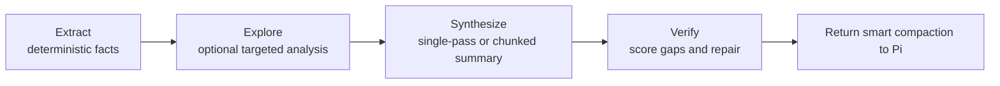

# pi-smart-compact

[](https://github.com/alpertarhan/pi-smart-compact/actions/workflows/ci.yml)
[](https://www.npmjs.com/package/pi-smart-compact)
[](https://www.npmjs.com/package/pi-smart-compact)
[](./LICENSE)
[](https://github.com/earendil-works/pi)

<p align="center">
  
</p>

> Verification-oriented smart compaction for the [Pi Coding Agent](https://github.com/earendil-works/pi-coding-agent).

`pi-smart-compact` replaces blind conversation trimming with a structured compaction pipeline that tries to preserve what an agent actually needs to continue working: the goal, modified files, unresolved errors, decisions, constraints, and open follow-up loops.

It uses an **EESV** pipeline:

**Extract → Explore → Synthesize → Verify**

## Highlights

- **Pi-native integration** — `/smart-compact`, `smart_compact`, and `session_before_compact` support.
- **Verification-oriented output** — deterministic extraction and repair before trusting LLM synthesis.
- **Adaptive cost profile** — skips unnecessary work on small sessions and uses chunking only when useful.
- **Operational safety** — pending summaries expire, backups are available, and metrics make regressions visible.
- **Companion-friendly** — designed to coexist with context hygiene tools such as `pi-toolkit`.

Under the hood, the design is grounded in two core ideas:

- **agentic compaction**: let the system inspect and reason about the session instead of collapsing everything into generic prose
- **Kamradt-style chunking**: break large conversations into more coherent segments before synthesis

---

## What this project is

This package is a **Pi extension** with three integration surfaces:

| Surface | Purpose |
| --- | --- |
| `/smart-compact` | manual compaction from the chat UI |
| `session_before_compact` | auto-run before Pi's default compaction |
| `smart_compact` tool | agent-callable compaction for long sessions |

The extension stages a short-lived pending summary in memory, then hands it back to Pi when compaction is applied.

---

## Project status

This is an actively maintained Pi extension. The public API is intentionally small, but the internals are still evolving as Pi's compaction lifecycle and extension APIs mature. Pin versions in production workflows if compaction behavior is mission-critical.

## Compatibility note

`pi-smart-compact` sits close to Pi's compaction path: it registers `session_before_compact`, reads the active branch and session log, stages a pending summary, and may call Pi's native compaction flow from `/smart-compact`.

Because of that, use extra care with extensions that also manipulate:

- **compaction hooks** — especially extensions that return a custom result from `session_before_compact`
- **session / branch history** — rewriting, pruning, reordering, or replacing entries before compaction
- **message identity** — removing entry IDs, tool-call IDs, or tool-result metadata used to align log entries
- **tool output content** — truncating or rewriting `toolResult` messages before extraction
- **compaction boundaries** — moving the keep/discard split or splitting `toolCall` / `toolResult` pairs
- **session log storage** — replacing or deleting Pi's `.jsonl` logs under `~/.pi/agent/sessions`

It is intentionally compatible with, and recommended alongside, [`pi-toolkit`](https://github.com/ersintarhan/pi-toolkit): pi-toolkit handles everyday context hygiene such as anchors, pivots, status lines, and old tool-output trimming; `pi-smart-compact` handles high-pressure verified compaction. The integration protects recent pi-toolkit anchors and can recover original tool outputs from the session log when older tool results were trimmed.

If you use another automatic compaction or context-rewriting extension, prefer enabling only one `session_before_compact` owner unless the hook order and returned values are explicitly coordinated.

---

## Why it exists

Default compaction often loses the parts that matter most during coding work:

- which files were actually changed
- which errors are still unresolved
- what the user explicitly asked for
- what decisions already won
- what should happen next

`pi-smart-compact` is built to preserve that operational context instead of producing a vague recap.

---

## How it works



### Pipeline summary

1. **Extract**
   - deterministically pulls files, errors, decisions, constraints, topics, and open loops from the session
2. **Explore**
   - optionally inspects the conversation more deeply when the session is complex
3. **Synthesize**
   - creates either a single-pass summary or a chunked hierarchical summary
4. **Verify**
   - checks the result against extracted facts and patches missing critical details

In short: **facts first, synthesis second, verification last**.

---

## What it tries to preserve

- user goal
- constraints and preferences
- modified / read / deleted files
- unresolved and resolved errors
- key decisions
- open follow-up work
- critical context needed for the next turn
- delta from the previous compaction

---

## Installation

### npm / Pi package

```bash
pi install npm:pi-smart-compact
```

### GitHub

```bash
pi install git:github.com/alpertarhan/pi-smart-compact
```

### Local development

```bash
cd ~/.pi/agent/extensions
git clone https://github.com/alpertarhan/pi-smart-compact.git
cd pi-smart-compact
bun install
bun run build
```

---

## Quick start

### Interactive

```bash
/smart-compact
```

With no arguments, the extension opens a small picker for:

1. model
2. profile

### Direct command examples

```bash
/smart-compact anthropic/claude-sonnet-4 balanced
/smart-compact dry-run
/smart-compact debug
/smart-compact metrics
/smart-compact dashboard
/smart-compact "focus on auth changes and unresolved follow-up work"
```

### Tool usage

```json
{
  "name": "smart_compact",
  "parameters": {
    "profile": "balanced",
    "verbose": false,
    "dry_run": false,
    "report": false,
    "dashboard": false
  }
}
```

The tool prepares a pending smart summary and lets Pi consume it on the next natural compaction.

---

## Usage notes

- auto/tool compaction is skipped when the context is still small enough (default: below 60% actual context usage)
- explicit manual `/smart-compact` commands bypass the 60% adaptive gate because the user intentionally requested compaction
- pi-toolkit `tool=XX%` status means tool-output ratio, **not** context fullness; smart-compact uses actual `context=XX%`
- the tool path does **not** compact the conversation mid-turn
- pending summaries are kept in memory for **5 minutes**
- exploration is adaptive and may be skipped for simple sessions
- use `/smart-compact metrics` for profile/provider comparisons
- use `/smart-compact dashboard` to open the interactive TUI dashboard (overview, latest run, current session, recent runs, or write HTML)

This keeps the extension helpful without forcing extra work when it is not needed.

---

## Configuration

Add this to `~/.pi/agent/settings.json`:

```json
{
  "smartCompact": {
    "profile": "balanced",
    "summaryModel": "anthropic/claude-sonnet-4",
    "segmentationModel": "anthropic/claude-haiku-3",
    "autoTrigger": true,
    "autoTriggerTimeoutMs": 120000,
    "minContextPercent": 60,
    "backupEnabled": true,
    "profiles": {
      "balanced": {
        "summaryBudgetTokens": 6000,
        "keepRecentTokens": 20000
      }
    }
  }
}
```

### Supported keys

| Key | Type | Default |
| --- | --- | --- |
| `profile` | `light \| balanced \| aggressive` | `balanced` |
| `summaryModel` | `string \| null` | `null` |
| `segmentationModel` | `string \| null` | `null` |
| `autoTrigger` | `boolean` | `true` |
| `autoTriggerTimeoutMs` | `number` | `120000` |
| `minContextPercent` | `number` | `60` |
| `backupEnabled` | `boolean` | `true` |
| `backupDir` | `string` | `~/.pi/agent/compact-backups` |
| `profiles` | partial per-profile overrides | built-ins |

### Profiles

| Profile | Summary budget | Keep recent | Typical use |
| --- | ---: | ---: | --- |
| `light` | 10000 | 30000 | preserve more detail |
| `balanced` | 6000 | 20000 | default general use |
| `aggressive` | 3000 | 10000 | tighter summaries |

### Backward compatibility

The extension still accepts the old config key `semanticCompact`, but `smartCompact` is the current key.

---

## Output contract

Generated summaries are expected to use this structure:

```markdown
## Goal
## Constraints & Preferences
## Progress
### Done
### In Progress
### Blocked
## Key Decisions
## Files Modified
## Files Read
## Open Loops
## Changes Since Last Compaction
## Next Steps
## Critical Context
## Topics Covered
```

The extension also builds a structured `CompactionState` for reuse across later compactions.

---

## Safeguards

The current design includes:

- deterministic extraction before summarization
- adaptive exploration
- chunked synthesis for larger sessions
- deterministic verification scoring
- deterministic patching before LLM patching
- hallucinated file-reference detection
- open-loop injection
- project fingerprinting and delta tracking
- provider-specific timeout and single-pass strategies
- multimodal attachment metadata preservation
- backup creation before compaction
- metrics logging, profile/provider comparison, and damage detection

---

## Runtime artifacts

At runtime, the extension writes to paths under `~/.pi/agent/`, including:

- `settings.json`
- `compact-backups/`
- `.cache/compact-extraction-<session>.json`
- `.cache/compact-metrics.jsonl`
- `.cache/smart-compact-report.html`
- `.cache/smart-compact/projects/<projectId>.json`
- `.cache/smart-compact/states/<projectId>.json`
- `.cache/smart-compact/damage-reports.jsonl`

---

## Repository layout

```text
.
├── src/
│   ├── index.ts              # extension registration + command routing
│   ├── constants.ts          # version, thresholds, prompts
│   ├── types.ts              # shared types
│   ├── app/                  # orchestration layer
│   │   ├── run-smart-compact.ts   # pipeline orchestrator (was core.ts)
│   │   ├── run-context.ts         # typed stage chain
│   │   ├── explore-wrap.ts        # explore re-export shim
│   │   └── steps/                 # 10 stage modules
│   │       ├── prepare.ts   →   resolves config + auth
│   │       ├── window.ts    →   picks compaction window
│   │       ├── recover.ts   →   recovers truncated messages
│   │       ├── tier.ts      →   chooses compaction tier
│   │       ├── extract.ts   →   pruning + extraction + cache
│   │       ├── synthesize.ts→   single-pass / EESV summarization
│   │       ├── verify.ts    →   structural verify + repair
│   │       ├── state.ts     →   state machine + open loops
│   │       ├── persist.ts   →   apply compaction
│   │       └── metrics.ts   →   success / failure metrics
│   ├── domain/               # pure semantics (no I/O)
│   │   ├── summary-schema.ts
│   │   └── summary-parse.ts
│   ├── phases/               # algorithms
│   │   ├── explore.ts
│   │   ├── synthesize.ts
│   │   └── verify.ts
│   ├── infra/                # external-world interaction
│   │   ├── fs.ts                # atomic writes, advisory locks
│   │   ├── paths.ts             # canonical paths
│   │   ├── git.ts               # git-root discovery (cached)
│   │   ├── clock.ts             # injectable clock
│   │   ├── llm-client.ts        # LLM client seam
│   │   ├── llm-retry.ts         # 429/5xx backoff
│   │   └── services.ts          # per-run services container
│   ├── ui/                   # TUI overlays + dashboard
│   │   ├── overlays.ts
│   │   └── dashboard-format.ts
│   └── utils/                # 13 focused utility modules
├── test/                     # 280+ tests across 28 files
├── docs/
├── dist/
└── package.json
```

See `ARCHITECTURE.md` for the full responsibility breakdown of each layer.

---

## Development

```bash
bun install
bun test
bun run build
bun run typecheck
```

Build output is published from `dist/`. Pull requests are expected to pass the same verification in GitHub Actions before merge.

---

## Project docs

- [`CHANGELOG.md`](./CHANGELOG.md) — release history
- [`ARCHITECTURE.md`](./ARCHITECTURE.md) — system design and execution model
- [`CONTRIBUTING.md`](./CONTRIBUTING.md) — contributor workflow and expectations
- [`SECURITY.md`](./SECURITY.md) — vulnerability reporting and data-handling notes
- [`SUPPORT.md`](./SUPPORT.md) — where to ask for help
- [`docs/RELEASE.md`](./docs/RELEASE.md) — release checklist

---

## License

MIT © [Alper Tarhan](https://github.com/alpertarhan)
