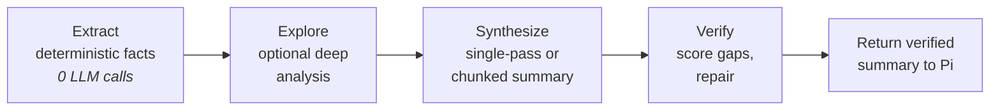

<div align="center">


[](https://github.com/alpertarhan/pi-smart-compact/actions/workflows/ci.yml)
[](https://www.npmjs.com/package/pi-smart-compact)
[](./LICENSE)
[](https://github.com/earendil-works/pi)

**Verification-oriented smart compaction for the [Pi Coding Agent](https://github.com/earendil-works/pi-coding-agent).**

</div>

Default compaction trims your conversation blind. `pi-smart-compact` keeps what
the agent actually needs to continue — the **goal, changed files, unresolved
errors, decisions, constraints, and open loops** — through a verified
**Extract → Explore → Synthesize → Verify** pipeline.

> Facts first, synthesis second, verification last.

---

## Why

Default compaction produces a vague recap and quietly drops the operational
context that matters most during coding. The result is the classic
*"didn't we already fix this?"* loop.

| Default compaction | `pi-smart-compact` |
| --- | --- |
| Trims by token count | Extracts facts deterministically (zero LLM) |
| Generic prose recap | Structured working-state summary |
| Loses files / errors / decisions | Preserves them, then **verifies** they survived |
| No regression signal | Damage detection + metrics dashboard |

## Install

```bash
pi install npm:pi-smart-compact
```

From GitHub:

```bash
pi install git:github.com/alpertarhan/pi-smart-compact
```

## Quick start

```bash
/smart-compact                              # interactive — pick model + profile
/smart-compact anthropic/claude-sonnet-4 balanced
/smart-compact "focus on auth + unresolved follow-ups"
/smart-compact metrics                      # profile / provider comparison
/smart-compact dashboard                    # interactive TUI dashboard
/smart-compact restore                      # list + view + restore backups
```

Or let the agent call it as a tool on long sessions:

```jsonc
{
  "name": "smart_compact",
  "parameters": { "profile": "balanced", "dashboard": false }
}
```

Auto-compaction also runs before Pi's native compact once context pressure
crosses your threshold (default 60% **actual** context usage).

## How it works



| Stage | What it does |
| --- | --- |
| **Extract** | Deterministically pulls files, errors, decisions, constraints, topics, and open loops — no LLM, the ground truth. |
| **Explore** | Optionally inspects the conversation more deeply when the session is complex. |
| **Synthesize** | Single-pass for short sessions, Kamradt-style chunked + assembled for long ones. |
| **Verify** | Scores the result against extracted facts and patches missing critical details. |

**What it preserves:** user goal · constraints & preferences · modified / read /
deleted files · unresolved & resolved errors · key decisions · open follow-up
work · critical next-turn context · the delta since the previous compaction.

## Integration surfaces

| Surface | When | Detail |
| --- | --- | --- |
| `/smart-compact` | Manual | Interactive picker or direct args; bypasses the adaptive gate. |
| `session_before_compact` | Auto | Runs before Pi's native compaction when context pressure is high. |
| `smart_compact` tool | Agent | Prepares a pending summary; Pi applies it on the next natural compact. |

A short-lived pending summary is staged in memory (5-minute TTL) and handed to
Pi when compaction is applied.

## Example output

A generated summary follows a stable, structured contract:

```markdown
## Goal
Add retry/backoff to the LLM client so transient 429/5xx don't abort compaction.

## Constraints & Preferences
- [requirement] never compact mid-turn from the tool path

## Progress
### Done
- [x] Added `withRetry` wrapper in src/infra/llm-retry.ts
### In Progress
- [ ] Wire retry client into the services container
### Blocked
- None

## Key Decisions
- **Honor Retry-After verbatim**: providers that set it know their limits best.

## Files Modified
- src/infra/llm-retry.ts
- src/infra/llm-client.ts

## Files Read
- src/app/run-smart-compact.ts

## Open Loops
- [high] Retried but unresolved: AbortSignal ignored by some providers

## Changes Since Last Compaction
- New files touched: src/infra/llm-retry.ts
- New loops: AbortSignal ignored by some providers

## Next Steps
1. Add an outer hard-timeout as a second line of defense

## Critical Context
- 408/425/429/5xx are retriable; 4xx (other) fails fast

## Topics Covered
- LLM retry wrapper (high)
```

A machine-readable `CompactionState` is built alongside it for reuse across
later compactions (delta tracking, damage detection).

## Configuration

Add to `~/.pi/agent/settings.json`:

```json
{
  "smartCompact": {
    "profile": "balanced",
    "summaryModel": "anthropic/claude-sonnet-4",
    "autoTrigger": true,
    "minContextPercent": 60,
    "backupEnabled": true
  }
}
```

| Key | Type | Default |
| --- | --- | --- |
| `profile` | `light \| balanced \| aggressive` | `balanced` |
| `summaryModel` | `string \| null` | `null` (uses session model) |
| `segmentationModel` | `string \| null` | `null` |
| `autoTrigger` | `boolean` | `true` |
| `autoTriggerTimeoutMs` | `number` | `120000` |
| `minContextPercent` | `number` | `60` |
| `backupEnabled` | `boolean` | `true` |
| `backupDir` | `string` | `~/.pi/agent/compact-backups` |
| `profiles` | per-profile overrides | built-ins |
| `pinPaths` | `string[]` | `[]` (paths always preserved) |

### Profiles

| Profile | Summary budget | Keep recent | Use when |
| --- | ---: | ---: | --- |
| `light` | 10000 | 30000 | preserve more detail |
| `balanced` | 6000 | 20000 | default, general use |
| `aggressive` | 3000 | 10000 | tighter summaries |

The legacy config key `semanticCompact` is still accepted.

## Safeguards

**Correctness**

- Deterministic extraction before any synthesis
- Verification scoring with deterministic patching **before** LLM patching
- Hallucinated file-reference detection (SemVer-aware)
- Open-loop injection + cross-compaction delta tracking
- Pinned-path preservation (`pinPaths`) — a deterministic, LLM-free guarantee
- Damage auto-remediation — re-read files feed forward and get re-preserved next compaction

**Safety**

- Conversation backups before compaction (retention-pruned), browsable + restorable via `/smart-compact restore`
- `toolCall` / `toolResult` pair integrity at the compaction boundary
- Cross-session leak guard on the pending summary
- Session-log recovery that bypasses truncation of older tool results

**Observability**

- Metrics logging with profile / provider comparison
- Post-compaction damage (regression) detection
- Interactive TUI + HTML dashboards

## Usage notes

- Auto / tool compaction is skipped while context is small (below 60% actual usage).
- Manual `/smart-compact` bypasses that gate — you asked for it.
- `pi-toolkit`'s `tool=XX%` means tool-output ratio, **not** context fullness;
  smart-compact uses actual `context=XX%`.
- The tool path does **not** compact mid-turn (it stages a pending summary).
- Exploration is adaptive and may be skipped for simple sessions.

## Companions & compatibility

`pi-smart-compact` is designed to coexist with — and recommended alongside —
[`pi-toolkit`](https://github.com/ersintarhan/pi-toolkit). pi-toolkit handles
everyday context hygiene (anchors, pivots, status lines, old tool-output
trimming); smart-compact handles high-pressure verified compaction. The
integration protects recent pi-toolkit anchors and recovers original tool
outputs from the session log.

Because smart-compact sits close to Pi's compaction path, take extra care with
extensions that also rewrite compaction hooks, branch history, entry IDs, tool
output, or the compaction boundary. If you run another automatic compaction /
context-rewriting extension, prefer a single `session_before_compact` owner
unless hook order is explicitly coordinated.

## Runtime artifacts

The extension writes under `~/.pi/agent/`:

| Path | Purpose |
| --- | --- |
| `settings.json` | configuration (read) |
| `compact-backups/` | conversation backups (retention-pruned) |
| `.cache/compact-extraction-<session>.json` | incremental extraction cache |
| `.cache/compact-metrics.jsonl` | metrics log (tail-retained, 5 MiB cap) |
| `.cache/smart-compact-report.html` | HTML dashboard |
| `.cache/smart-compact/projects/<projectId>.json` | project fingerprint |
| `.cache/smart-compact/states/<projectId>.json` | reusable compaction state |
| `.cache/smart-compact/damage-reports.jsonl` | regression signals (tail-retained, 5 MiB cap) |
| `.cache/smart-compact/remediation-<projectId>.json` | files to re-preserve after damage |

## Development

```bash
bun install
bun run typecheck   # tsc --noEmit
bun test            # full test suite
bun run bench       # repeatable hot-path benchmark
bun run build       # dist/ output for publishing
```

Pull requests run the same verification in GitHub Actions before merge.

## Documentation

- [`ARCHITECTURE.md`](./ARCHITECTURE.md) — system design, execution model, layer responsibilities
- [`CHANGELOG.md`](./CHANGELOG.md) — release history
- [`CONTRIBUTING.md`](./CONTRIBUTING.md) — contributor workflow and expectations
- [`SECURITY.md`](./SECURITY.md) — vulnerability reporting and data-handling notes
- [`SUPPORT.md`](./SUPPORT.md) — where to ask for help
- [`docs/RELEASE.md`](./docs/RELEASE.md) — release checklist

## License

MIT © [Alper Tarhan](https://github.com/alpertarhan)
