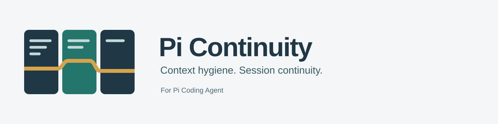

<p align="center">
  
</p>

# Pi Continuity

Keep useful working context. Keep the way back.

Pi Continuity helps a long-running [Pi Coding Agent](https://github.com/earendil-works/pi)
session manage noisy tool output, recover evidence, and carry goals, constraints,
decisions and unfinished work through compaction. Compaction is one part of the
job—not the whole product.

**[Get started](#get-started)** · [User guide](./docs/guide.md) ·
[Configuration](./docs/configuration.md) · [All documentation](./docs/README.md)

> **New identity, same installation.** The npm package is still
> `pi-smart-compact`; `/smart-compact`, `smart_*` tools and `smartCompact` settings
> are unchanged. Existing menus may still say **Smart Compact**. No configuration
> or data migration is needed. [Naming and scope](./docs/identity.md).
>
> **Source documentation.** This checkout is the local, unpublished
> `9.8.0-canary.7` candidate. The npm install below selects the published package,
> which may not contain everything shown here. See the [changelog](./CHANGELOG.md).

## What it does

| When you need to… | Use… | What to expect |
| --- | --- | --- |
| Keep large tool output out of the active context | **Context hygiene** | Eligible output can be stored behind retrievable references; protected instructions, failures and recent work stay in context. |
| Finish a research detour without carrying every read | **Checkpoint and rewind** | Keep a handoff report and a recovery path. Files and external side effects are not rolled back. |
| Make room for the next stage of a task | **Verified compaction** | Extract working-state facts, synthesize a bounded summary, and check it before Pi applies it. |
| Find the way back after a long detour | **Session navigation** | Named anchors with summaries; read-only search across earlier sessions; return to an anchor on a new branch with a required carryover. Files and processes are never rolled back. |
| Start a fresh session without losing the thread | **Handoff** | A new session seeded from recorded state only (your note, the latest anchor, the continuity ledger, always-kept files, a memory recall); no model call. Its archived evidence stays readable from the new session. |
| Carry a confirmed fact into another session | **Optional project memory** | Explicit saves and scoped recall through exactly one selected backend. No silent backend fallback. |

The intended result is a smaller **working set**, not an inaccessible history.
Rewind, tool-output archives, compaction backups and project memory are different
mechanisms; none substitutes for all the others.

## Get started

Requires **Pi 0.87.1+** and **Node.js 22.19+**.

```bash
pi install npm:pi-smart-compact
```

Inside Pi:

```text
/smart-compact
```

Opening Home changes nothing. Start with **Settings → How it runs** and choose
how much control to give the extension:

| Choice | Behavior |
| --- | --- |
| **Manual only** | You start compaction or cleanup. No extension-scheduled work. |
| **Manual + agent** | You or the agent can request compaction. |
| **Cleanup only** | Local, recoverable cleanup under pressure; no automatic summary generation. |
| **Fully automatic** | Cleanup plus compaction requested when the agent is idle and context reaches the configured threshold. |

These are deliberate choices, not an installation-time migration. Pi's own
compaction setting is separate. The built-in **With Pi (default)** behavior
participates when Pi starts compaction; it does not independently schedule it.
[Understand the trigger settings](./docs/configuration.md).

For your first compaction, choose **Compact now**, inspect the estimated plan,
then review the result. **A** applies it; **C** or **Esc** cancels. Pressing
**Enter** on the review screen does not apply a summary. The default requires
this approval; explicitly disabling `requireApproval` changes that behavior.

### Optional components

The install above downloads nothing beyond the extension. Three opt-in
features need a component you install yourself, once, into Pi's package
directory. Nothing is downloaded, started or configured on your behalf.

| Feature (off by default) | Component | Size on disk (macOS arm64) |
| --- | --- | --- |
| Memory store `Mnemopi` | `@oh-my-pi/pi-mnemopi@18.3.1` (with its `@oh-my-pi/*` engine packages) | about 195 MB |
| Mnemopi without a Bun 1.3.14+ on `PATH` | `bun@1.4.2` | about 60 MB |
| Image snapshots (`visualArchiveEnabled`) | `@resvg/resvg-js@2.6.2` | about 3.5 MB |

Pi installs extensions with `npm install --prefix ~/.pi/agent/npm
--legacy-peer-deps`, so these optional peers are never pulled in. When a
selected feature is missing its component, **Status & help → Readiness &
details** shows the exact command for your install root, for example:

```bash
npm install @oh-my-pi/pi-mnemopi@18.3.1 bun@1.4.2 --prefix ~/.pi/agent/npm --legacy-peer-deps
```

The component stays in that directory across `pi update` because npm records
it there. With Pi configured for bun or pnpm, use the equivalent add command
for the same directory.

## One Home, five choices

```text
Smart Compact

Compact now
Clean up tool output
Settings
History & recovery
Status & help
```

The header shows context usage and effective automatic/agent permissions.
Unavailable actions explain why. Use arrows and Enter to navigate, Esc to go
back, and **D** for planning or result details. Long help and summaries can be
scrolled to the end; advanced settings do not crowd the main action.

Five useful direct commands:

```text
/smart-compact trim
/smart-compact storage
/smart-compact context
/smart-compact handoff [dry-run] [-- note]
/smart-compact metrics
```

- **`trim`** queues local cleanup without a model call or forced turn. The first
  next provider request is still untrimmed; the edit commits at the next natural
  completed-turn boundary.
- **`storage`** reports archived tool output. It never deletes anything; an
  unreferenced result in one scan is not proof that it is safe to delete.
- **`context`** opens session navigation: browse anchors, mark this point,
  search other sessions, or return to an anchor after reading it.
- **`handoff`** opens a new session seeded from recorded state (preview first
  with `dry-run` or from Home › History & recovery); no model call.
- **`metrics`** shows effective state, recent issues, recorded run outcomes and
  the host prompt-cache ledger.

By default the agent sees one small loader tool, `smart_tools`, and loads the
navigation, history, memory or compaction tools only when it needs them; the
context guide is read on request, never injected. **Always available** and
**Off** are one setting away. See the [user guide](./docs/guide.md) for agent
tools, checkpoint/rewind, retrieval, backups, model selection and recovery.

## Keep the thread through the whole session

A useful continuation needs more than the last few messages: an early
constraint, a decision made halfway through, and the final unresolved failure
can all matter to the next step.

The Kamradt-inspired intuition here is **coverage across the conversation**.
Coherent chunks and working-state extraction feed a bounded synthesis. This is
not a literal algorithm that reads only three excerpts, and it is not a promise
of lossless recall.

```text
Reduce avoidable noise
        ↓
Keep evidence recoverable
        ↓
Carry working state through compaction
        ↓
Continue the task, with a way to retrieve missing detail
```

Within compaction, **Extract → Explore → Synthesize → Verify (EESV)** separates
recorded facts from generated prose. Exploration is mode-dependent; verification
is primarily deterministic. A verifier score measures those checks, not semantic
truth or autonomous task success.

Pi still owns the session and compaction lifecycle. Pi Continuity adds selection,
recovery and preservation policies around it. [Architecture](./ARCHITECTURE.md).

## Memory is optional; continuity is the core

Session continuity does not require a remote memory service.

- **Local graph:** scoped project recall on this machine.
- **Mnemopi:** an optional local engine with its own project store.
- **Hindsight:** your existing server and bank—not one installed or started by
  this extension.

Only the selected backend is consulted or written. Inactive stores stay
untouched. Explicit saves require confirmation. When enabled, the local graph
also indexes derived state after host-confirmed compactions. Session ledgers,
output archives and backups remain separate from cross-session memory.

[Memory workflows](./docs/guide.md) · [Hindsight setup and privacy](./docs/hindsight-memory.md)

## Boundaries worth knowing

- **No automatic trigger means no automatic compaction.** `native-hook` depends
  on Pi initiating compaction; `settled` can request it independently when idle.
  A threshold alone does not enable either one.
- **Recovery is bounded.** Rewind is not a filesystem rollback. Archives can
  restore recorded output, not bytes omitted before the host recorded it.
- **Summary quality is not guaranteed.** Verification rejects known gaps;
  extraction and heuristics can still miss information. Read the preview.
- **Experimental output is opt-in.** Provider-native summaries are not EESV
  verified. Images require a supported reader and cost check; otherwise text is
  used. Neither is a default replacement for verified text.
- **Claude subscription requests need the separate adapter.** Requests this
  extension makes itself go through Pi's model runtime; on Claude OAuth routes
  that runtime needs `pi-claude-oauth-adapter`, and the published `0.2.2`
  normalizes only Pi's own requests. pi-toolkit's auto-context must not be
  loaded alongside session navigation.
- **Budgets still matter.** A slow provider can exceed your deadline. Cancelled
  work is not an applied compaction, and unused background preparation still costs.
- **Offline evidence is not a savings claim.** Scripted sessions validate
  lifecycle and recovery behavior, not live model quality, billing or promotion.

See [configuration](./docs/configuration.md), [security](./SECURITY.md) and
[evaluation limits](./docs/evaluation.md).

## Documentation and development

| Need | Start here |
| --- | --- |
| Use the extension or recover a session | [User guide](./docs/guide.md) |
| Understand a setting, mode or budget | [Configuration reference](./docs/configuration.md) |
| Understand invariants and module responsibilities | [Architecture](./ARCHITECTURE.md) |
| Interpret measurements or run an evaluation | [Evaluation](./docs/evaluation.md) |
| Work on the code or prepare a release | [Contributing](./CONTRIBUTING.md) · [Release checklist](./docs/RELEASE.md) |
| Report a problem | [Support](./SUPPORT.md) · [Security policy](./SECURITY.md) |
| Find historical experiments and migration notes | [Documentation index](./docs/README.md) |

MIT © [Alper Tarhan](https://github.com/alpertarhan). The package and repository
remain [`pi-smart-compact`](https://github.com/alpertarhan/pi-smart-compact).
