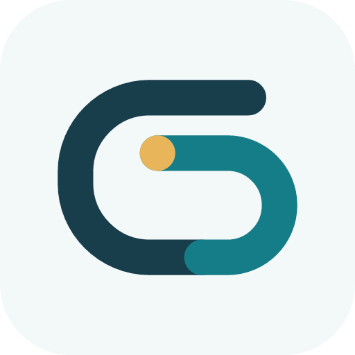

# Pi Continuity: identity and naming

[Documentation](./README.md) · [Project overview](../README.md)

## Product name

**Pi Continuity** describes the goal: keep useful working context and a way back
to evidence through long coding sessions. Context hygiene, recoverable research,
compaction and optional project memory support that goal.

The name does not promise lossless compression, perfect recall, persistent model
attention or an independent session engine. Pi owns the session lifecycle.

## What changed—and what did not

This is a product-identity and documentation change, not a package migration.

| Surface | Name |
| --- | --- |
| Product identity and visual assets | **Pi Continuity** |
| npm package | `pi-smart-compact` |
| Repository | `alpertarhan/pi-smart-compact` |
| Command and current TUI title | `/smart-compact` / Smart Compact |
| Agent tool family | `smart_*`: loader, navigation, history, memory and compaction tools |
| Settings namespace | `smartCompact` |
| Runtime directories, record types and reference formats | Unchanged |

Install with `pi install npm:pi-smart-compact`. Do not install `pi-continuity`
or rename settings, directories, memory tags or references because of the
branding. Existing state needs no migration.

The npm name-availability check on 2026-09-27 was an observation, not a
reservation, trademark clearance or guarantee of future availability. No new
package is published by this identity change.

## Visual language

The mark is one **open return path**. Its outer curve holds the working context;
the inner turn leads back to a gold anchor. It expresses recoverability without
using a generic compression arrow, database stack or infinity symbol. This is a
visual metaphor, not a diagram of the compaction algorithm.

| Role | Color | Use |
| --- | --- | --- |
| Deep ink | `#183E4B` | Outer path and wordmark |
| Return teal | `#147D88` | Inner return path |
| Anchor gold | `#E8B55B` | One retained point; never body text |
| Supporting ink | `#466674` | Banner descriptor |
| Mist | `#F3F8F9` | Banner and rounded catalog tile |

The wordmark uses **Avenir Next Demi Bold**; the descriptor uses **Avenir Next
Regular**. Both are converted to vector paths in the master artwork. Rendering
and PNG export require no installed fonts, network requests or embedded font
files. Documentation body type follows the reader's GitHub/npm renderer; the
runtime's separate DejaVu font is not a branding font.

Keep the supplied proportions and clear space. Use the catalog tile on light or
dark surfaces rather than recoloring the mark. Use at least **32×32** for a
standalone icon; the banner is a wordmark, not a place for essential instructions.
Installation steps, controls and warnings must remain available as text.

## Visual assets

<p>
  
</p>

| File | Dimensions | Purpose |
| --- | --- | --- |
| [`banner.svg`](./assets/banner.svg) | 1280×320 | **Editable master**: mark, outlined wordmark and descriptor. Self-contained SVG with a title and description. |
| [`banner.png`](./assets/banner.png) | 1280×320 | README banner; raster compatibility without a font dependency. |
| [`pi-smart-compact.svg`](./assets/pi-smart-compact.svg) | 512×512 | Generated catalog tile; vector reuse at any size. |
| [`pi-smart-compact.png`](./assets/pi-smart-compact.png) | 512×512 | Generated catalog image at the established `package.json` → `pi.image` URL. |

The master replaces the former separately generated PNG artwork. All exports
now share its geometry and palette. Keep the existing filenames and catalog URL;
there is no separate theme-specific logo to maintain.

### Regenerate the exports

From a source checkout with development dependencies installed
(`bun install --frozen-lockfile`), run the following with the pinned
`@resvg/resvg-js@2.6.2`. It uses no system fonts and makes no network request:

```bash
bun --eval '
import { readFileSync, writeFileSync } from "node:fs";
import { Resvg } from "@resvg/resvg-js";

const root = "docs/assets/";
const banner = readFileSync(root + "banner.svg", "utf8");
const mark = banner.match(/<g id="continuity-mark">[\s\S]*?<\/g>/)?.[0];
if (!mark) throw new Error("Missing continuity-mark group in banner.svg");
const icon = `<svg xmlns="http://www.w3.org/2000/svg" width="512" height="512" viewBox="0 0 320 320" role="img" aria-labelledby="title description">
  <title id="title">Pi Continuity</title>
  <desc id="description">An open return path with a gold anchor: useful context kept within reach.</desc>
  <!-- Generated from banner.svg; regenerate using docs/identity.md. -->
  <rect width="320" height="320" rx="64" fill="#F3F8F9"/>
  <g transform="translate(-8 0)">${mark}</g>
</svg>
`;
writeFileSync(root + "pi-smart-compact.svg", icon);
for (const [name, svg] of [["banner", banner], ["pi-smart-compact", icon]]) {
  const image = new Resvg(svg, { font: { loadSystemFonts: false } }).render();
  writeFileSync(root + name + ".png", image.asPng());
}
'
```

Edit `banner.svg`, not the generated files. Keep `continuity-mark` as a flat
group: the export command extracts that group and centers it on the catalog tile.
If you change the lettering, convert it to paths again before export. Review the
banner at README width and the icon at 32 and 64 pixels on light and dark surfaces.
Do not add generated previews to the repository.

## A full rename would be a separate release

No package rename is scheduled here. A future rename would need explicit
release-owner approval, ownership checks, a complete public-interface cutover,
and a tested migration for existing settings, sessions, references and stored
state. Renaming a directory is not a data migration.

There are no new command aliases, runtime shims, automatic data moves or
duplicate packages in this branding change.
